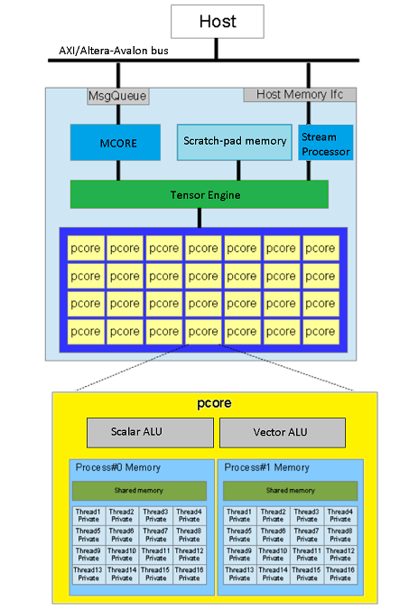

# Hardware architecture

ztachip hardware architecture is composed of the following components

### **pcores**

ztachip has an array of light weight processors (pcores).

pcore has VLIW (very long instruction word) architecture. This allows for multiple instructions to be executed per clock cycle.

pcore is also a vector processor, capable of wide vector operations.

Each pcore has 16 hardware threads capable of zero-overhead task switching done in hardware.

Each pcore has a shared memory space that is shared among all the 16 threads.

Each thread also has its own private memory space.

pcore memory space is further partitioned into 2 seperate process space. This allows for memory cycle to one process to overlap with execution cycle on the other process.

### **mcore**

Processor (MIPS based) that dispatches high level tensor instructions to Tensor Engine.

Tensor instructions sent to Tensor Engine include instructions to do complex tensor data transfer and tensor operator requests to be executed by pcore array.

There can be 2 threads running on mcore. This allows for one thread memory cycles to overlap with the other thread execution cycles.

This helps ztachip achieves good computing efficiency.

NeuralNet convolution is executed with 90% efficiency compared with peak performance.

### **Tensor engine**

Special hardware block that executes high level tensor instructions that are dispatched from mcore.

Tensor instructions performed by Tensor Engine are:

- Complex tensor data transfer such as tensor reshape,resize,reorder,scatter-gather transfer. 

- Schedules pcore array to perform tensor operators.

- Coordinate data transfer between scratch-pad memory, pcore memory and external memory. 

### **Stream processor**

There is a stream processor that intercepts data transfer between pcore arrays and external memory bus.

This allows for streaming operations to be applied to data read/written to external memory.

Stream processor can implement arbitrary non-linear processing via table lookup.

For more information, reference [ztachip hardware design description](https://github.com/ztachip/ztachip/blob/master/Documentation/HardwareDesignDoc.md)

