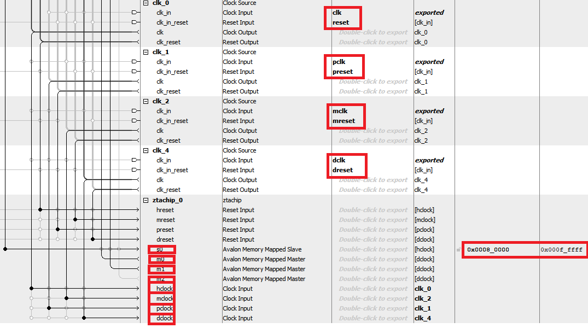

# ZTACHIP FPGA build procedure

This document describes FPGA build procedure and board configuration targeting [DE10-NANO board](https://www.terasic.com.tw/cgi-bin/page/archive.pl?Language=English&CategoryNo=165&No=1046) running [Linux Xfce Desktop](https://www.terasic.com.tw/cgi-bin/page/archive.pl?Language=English&CategoryNo=165&No=1046&PartNo=4) or [Linux Console](https://www.terasic.com.tw/cgi-bin/page/archive.pl?Language=English&CategoryNo=165&No=1046&PartNo=4) as its Linux operating system.

## Flash Linux to DE10-NANO

For a console only version of Linux. Install [Linux Console](https://www.terasic.com.tw/cgi-bin/page/archive.pl?Language=English&CategoryNo=165&No=1046&PartNo=4) version.

For a GUI desktop version, install [Linux Xfce Desktop](https://www.terasic.com.tw/cgi-bin/page/archive.pl?Language=English&CategoryNo=165&No=1046&PartNo=4) version. The FPGA image associated with this version is slightly larger since it requires IP block for HDMI driver.

## Install ubuntu for your build environment.

Install Ubuntu on your desktop. If you only have Windows based PC, you can install Ubuntu under VirtualBox which allows you to run Ubuntu Linux from within Windows.

This build procedure has been verified to be built successfully with Ubuntu 18.04 or later

## Download and install Intel Quartus Development Suite.

Download and install [Quartus Prime Lite Edition version 17.0](https://fpgasoftware.intel.com/17.0/?edition=lite)

## Download ztachip from github

```
   cd ~ 
   git clone https://github.com/ztachip/ztachip.git
```

## Open reference design project file

Launch Quartus Prime Lite Edition. Then...

- Open [ZTACHIP]/hardware/examples/DE10_NANO_SoC_FB/DE10_NANO_SoC_FB.qpf if you use Linux Xfce Desktop version of Linux

- Open [ZTACHIP]/hardware/examples/DE10_NANO_SoC_FB/DE10_NANO_SoC_GHRD.qpf if you use Linux Console version of Linux

For remaining of document, [TARGET] is used to indentify DE10_NANO_SoC_FB or DE10_NANO_SoC_GHRD depending on the your choice of target Linux version, and [ZTACHIP] is used to identify installation folder of ztachip.

## How to integrate ztachip to your FPGA project 

This section provides explanation on how ztachip can be integrated to your design.

ztachip is integrated to a FPGA design as a Qsys component. 

ztachip QSYS component is defined in [ztachip_hw.tcl](https://github.com/ztachip/ztachip/blob/master/hardware/HDL/ztachip_hw.tcl)

After QSYS IP search path is set to [WORKSPACE]/ztachip/hardware/HDL, QSYS should detect ztachip component package and make it available to be inserted to model.

Picture below shows ztachip qsys configuration as defined in [WORKSPACE]/ztachip/hardware/examples/[TARGET]/soc_system.qsys 



In the qsys configuration above, we have the following ztachip elements:

   - clk/reset: This is clock domain (50mhz) for Host to FPGA register access memory bus.

   - pclk/preset: This is clock domain (140mhz) for pcore processors.

   - mclk/mreset: This is clock domain (120mhz) for mcore processor.

   - dclk/dreset: This is clock domain (180mhz) for FPGA to DDR memory bus.

   - s0: This is Host to FPGA register access bus. It runs on clk/reset clock domain.

   - m0: This is first FPGA to DDR access memory bus. It runs on dclk/dreset clock domain.

   - m1: This is second FPGA to DDR access memory bus. It runs on dclk/dreset clock domain.

   - hclock: Tied to clk/reset clock domain.

   - mclock: Tied to mclk/mreset clock domain.

   - pclock: Tied to pclk/preset clock domain.

   - dclock: Tied to dclk/dreset clock domain.

   - 0x80000-0xFFFFF: This is the memory mapped address for ztachip register access. This value is to be entered to ztahostInit as described in [Application Programmer Guide](https://github.com/ztachip/ztachip/blob/master/Documentation/app_programmer_guide.md)

Also include [ztachip.qip](https://github.com/ztachip/ztachip/blob/master/hardware/HDL/ztachip.qip) to your project build. This will include all ztachip HDL files.

## Build Qsys 

First generate code with Qsys. This is Quartus high level design description.

From Quartus...

- Under Tools->Qsys,open [ZTACHIP]/hardware/examples/[TARGET]/soc_system.qsys

- Under Tools->Option,set IP SearchPath=[ZTACHIP]/hardware/HDL

- File -> RefreshSystem

- Generate->Generate HDL->Generate button

- Close Qsys

## Build FPGA image

From Quartus...

Processing -> Start compilation

## Install FPGA image on target

Quartus produces FPGA image in SOF format. 

We need to convert it to RBF format for target with command below...

```
   cd [ZTACHIP]/hardware/examples/[TARGET]/output_files
   quartus_cpf -c -o bitstream_compression=on [TARGET].sof soc_system.rbf
```

Copy the resulted soc_system.rbf to SDCard.

## Install Intel Embedded Studio

Install the following packages required by Intel Embedded Studio

      sudo apt-get install lib32z1
      sudo apt-get update
      sudo apt-get install libgtk2.0-0:i386 libidn11:i386 libglu1-mesa:i386 libxmu6:i386
      sudo apt-get install libpangox-1.0-0:i386 libpangoxft-1.0-0:i386

Download [Intel Embedded Studio](https://fpgasoftware.intel.com/soceds/17.0/?edition=standard&platform=linux&download_manager=direct).
This document is based on Intel Embedded Studio v17.0

Run Intel Embedded Studio installer. Choose your home folder as installation folder.

````
      sudo ./SoCEDSSetup-17.0.0.595-linux.run
```

Open a console terminal and issue the command below to set Embedded Studio build environment.

```
   ~/intelFPGA/17.0/embedded/embedded_command_shell.sh 
```

## Build and install preloader image.

Associate with every FPGA image, especially when there is a change to FPGA-DDR memory interface, you also need to build and flash a new preloader image to MicroSD card. 

Run command below...

```
   bsp-editor
```

In the BSP Editor screen, 

   - Click File -> < New HPS BSP >

   - In the < Preloader Setting Directory >, choose [ZTACHIP]/hardware/examples/[TARGET]/hps_isw_handoff/soc_system_hps_0 

   - Click OK then Generate and then Exit.

```
   cd [ZTACHIP]/hardware/examples/[TARGET]/software/spl_bsp
   make
   make uboot
```

Then flash preloader image to SDCard with command below. Change xxx with your SDCard device name.

```
   alt-boot-disk-util -p preloader-mkpimage.bin -a write /dev/xxx
```

## Build device tree

Procedure below generates device tree from QSYS configuation file.

```
cd [ZTACHIP]/hardware/examples/[TARGET]

sopc2dts --input soc_system.sopcinfo  --output soc_system.dtb  --type dtb  --board soc_system_board_info.xml  --board hps_common_board_info.xml  --bridge-removal all  --clocks
```

Then copy soc_system.dtb to SDCard...

## Update uboot.scr

This file tells uboot which FPGA image to load at boot time.

From Ubuntu console command

Create a file u-boot.txt with the following content

```
fatload mmc 0:1 $fpgadata soc_system.rbf;
fpga load 0 $fpgadata $filesize;
run bridge_enable_handoff;
mw 0xffc2508c 0;
run mmcload;
run mmcboot;
```

Then run the command below to convert u-boot.txt to u-boot.scr format.

```
mkimage  -A arm -O linux -T script -C none -a 0 -e 0 -n "My script" -d u-boot.txt u-boot.scr
```

Then copy u-boot.scr to DE10-NANO's SDCard.


### Setting up uboot parameters. 

To change UBOOT boot parameters. Do the following procedure to begin the editing...

- Open serial port to DE10-NANO with baudrate 115200.(Refer to DE10-NANO user manual on how to setup serial port)

- Reboot the board

- As soon as there is output on serial port, hit Enter key to stop the booting process.

- Now you should be in uboot command prompt.

ztachip needs some physical memory. Modify UBOOT parameter to reserve some physical memory (512K in this example).

Issue command below to Tell Linux to use only the top 512K of memory and the bottom 512K of memory is reserved for ztachip.

```
   setenv mmcboot 'setenv bootargs console=ttyS0,115200 root=${mmcroot} rw rootwait mem=512M;bootz ${loadaddr} - ${fdtaddr}'
```

Issue command below to tell uboot about device tree

```
   setenv fdtimage soc_system.dtb
```

Now save uboot parameters to flash and the reboot

```
      saveenv
      reset
```

Now you are done with FPGA build and board preparation. You can now proceed with [Software Build Procedure](https://github.com/ztachip/ztachip/blob/master/Documentation/BuildProcedure.md)

