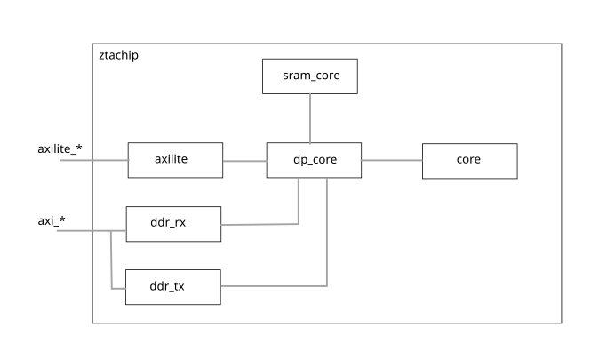
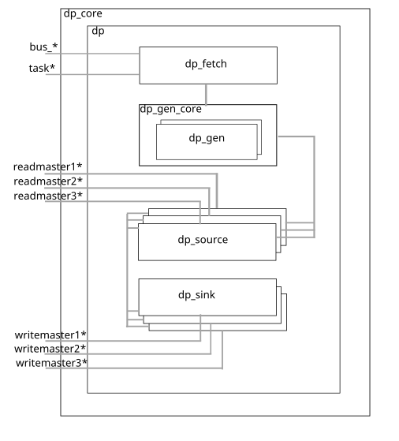
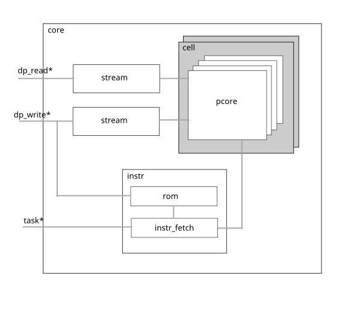
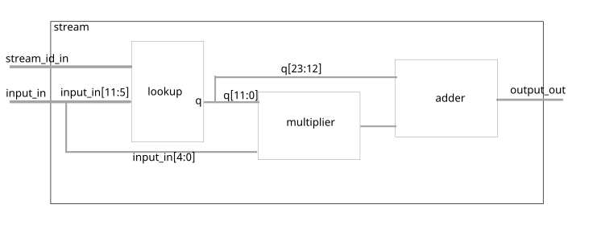
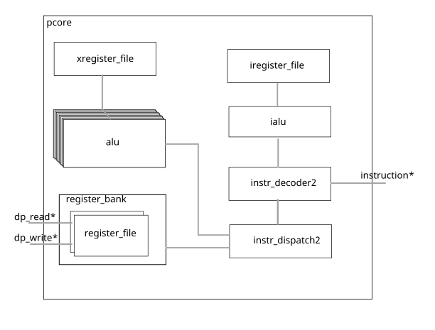
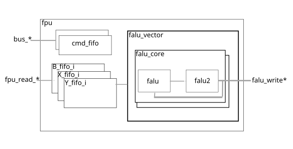

<style>
pre { background:#e4e6e8 !important;
      padding:12px 14px; border:1px solid #d8dce0; border-radius:6px; }

/* Base: the highlighter paints tokens with the editor theme, which on a dark
   theme is far too light for this grey. Everything starts near-black ... */
pre, pre code, pre span, pre * {
      background:transparent !important; color:#1f2328 !important; }

/* ... then the token classes take over, in a palette meant for a light
   background. These are more specific, so they win over the rule above. */
pre code .hljs-comment, pre code .hljs-quote {
      color:#6a737d !important; font-style:italic; }
pre code .hljs-keyword, pre code .hljs-selector-tag,
pre code .hljs-literal, pre code .hljs-doctag {
      color:#d73a49 !important; }
pre code .hljs-string, pre code .hljs-meta-string,
pre code .hljs-regexp { color:#032f62 !important; }
pre code .hljs-number, pre code .hljs-built_in,
pre code .hljs-type, pre code .hljs-variable,
pre code .hljs-template-variable { color:#005cc5 !important; }
pre code .hljs-title, pre code .hljs-section,
pre code .hljs-function .hljs-title { color:#6f42c1 !important; }
pre code .hljs-meta, pre code .hljs-meta-keyword {
      color:#e36209 !important; }
pre code .hljs-attr, pre code .hljs-attribute,
pre code .hljs-name { color:#22863a !important; }
pre code .pl-c, pre code .pl-c span {
      color:#6a737d !important; font-style:italic; }
pre code .pl-k { color:#d73a49 !important; }
pre code .pl-s, pre code .pl-s span, pre code .pl-pds {
      color:#032f62 !important; }
pre code .pl-c1, pre code .pl-cce { color:#005cc5 !important; }
pre code .pl-en, pre code .pl-entl { color:#6f42c1 !important; }

/* inline code: !important so a dark editor theme cannot repaint it */
code { background:#e4e6e8 !important; color:#1f2328 !important;
       padding:1px 4px; border-radius:4px; }

/* tables need visible rules on the white page */
table { border-collapse:collapse !important; margin:6px 0 14px 0; }
table th, table td { border:1px solid #c9ced4 !important;
       padding:6px 10px !important; }
table th { background:#eef1f4 !important; color:#1f2328 !important;
       text-align:left; }
table tr, table tbody tr:nth-child(2n) {
       background:#ffffff !important; color:#1f2328 !important; }
</style>

<div style="display:flex; align-items:flex-start; gap:0; background:#ffffff; color:#24292f;">

<div style="flex:0 0 auto; width:200px; min-width:120px; max-width:70%; resize:horizontal; overflow:auto; height:100vh; box-sizing:border-box; position:sticky; top:0; padding:12px 14px 24px 14px; background:#000000; color:#e8eaed; font-size:13px; line-height:1.7;">

<a href="index.md" style="display:inline-block; margin-bottom:12px; padding:5px 10px; background:#1f2937; color:#e8eaed; border:1px solid #3a4553; border-radius:5px; text-decoration:none; font-size:12px;">&#8592; Home</a>

<div style="background:#d6e8ff; color:#0b2545; padding:9px 10px; border-radius:6px; text-align:center; font-weight:bold; font-size:13px; line-height:1.35; margin-bottom:14px;">ztachip<br>Hardware Architecture</div>

<b>Contents</b>

<details open>
<summary><b><a href="#1-ztachip-top" style="color:#e8eaed; text-decoration:none;">1. ztachip</a></b></summary>
<ul style="margin:4px 0 4px 6px; padding-left:14px;">
<li><a href="#11-interfaces" style="color:#e8eaed; text-decoration:none;">1.1 Interfaces</a></li>
<li><a href="#12-subcomponents" style="color:#e8eaed; text-decoration:none;">1.2 Subcomponents</a></li>
<li><a href="#13-functions" style="color:#e8eaed; text-decoration:none;">1.3 Functions</a></li>
</ul>
</details>

<details open>
<summary><b><a href="#2-ztachipdp_core" style="color:#e8eaed; text-decoration:none;">2. ztachip.dp_core</a></b></summary>
<ul style="margin:4px 0 4px 6px; padding-left:14px;">
<li><a href="#21-interfaces" style="color:#e8eaed; text-decoration:none;">2.1 Interfaces</a></li>
<li><a href="#22-subcomponents" style="color:#e8eaed; text-decoration:none;">2.2 Subcomponents</a></li>
<li><a href="#23-functions" style="color:#e8eaed; text-decoration:none;">2.3 Functions</a></li>
</ul>
</details>

<details open>
<summary><b><a href="#3-ztachipfpu" style="color:#e8eaed; text-decoration:none;">3. ztachip.fpu</a></b></summary>
<ul style="margin:4px 0 4px 6px; padding-left:14px;">
<li><a href="#31-interfaces" style="color:#e8eaed; text-decoration:none;">3.1 Interfaces</a></li>
<li><a href="#32-subcomponents" style="color:#e8eaed; text-decoration:none;">3.2 Subcomponents</a></li>
<li><a href="#33-functions" style="color:#e8eaed; text-decoration:none;">3.3 Functions</a></li>
</ul>
</details>

<details open>
<summary><b><a href="#4-ztachipcore" style="color:#e8eaed; text-decoration:none;">4. ztachip.core</a></b></summary>
<ul style="margin:4px 0 4px 6px; padding-left:14px;">
<li><a href="#41-interfaces" style="color:#e8eaed; text-decoration:none;">4.1 Interfaces</a></li>
<li><a href="#42-subcomponents" style="color:#e8eaed; text-decoration:none;">4.2 Subcomponents</a></li>
<li><a href="#43-functions" style="color:#e8eaed; text-decoration:none;">4.3 Functions</a></li>
</ul>
</details>

<details open>
<summary><b><a href="#5-ztachipcorestream" style="color:#e8eaed; text-decoration:none;">5. ztachip.core.stream</a></b></summary>
</details>

<details open>
<summary><b><a href="#6-ztachipcorepcore" style="color:#e8eaed; text-decoration:none;">6. ztachip.core.pcore</a></b></summary>
<ul style="margin:4px 0 4px 6px; padding-left:14px;">
<li><a href="#61-interfaces" style="color:#e8eaed; text-decoration:none;">6.1 Interfaces</a></li>
<li><a href="#62-subcomponents" style="color:#e8eaed; text-decoration:none;">6.2 Subcomponents</a></li>
<li><a href="#63-functions" style="color:#e8eaed; text-decoration:none;">6.3 Functions</a></li>
</ul>
</details>

<details open>
<summary><b><a href="#7-ztachipcorepcoreregister_bank" style="color:#e8eaed; text-decoration:none;">7. ztachip.core.pcore.register_bank</a></b></summary>
</details>

<details open>
<summary><b><a href="#8-ztachipcorepcoreinstr_decoder2" style="color:#e8eaed; text-decoration:none;">8. ztachip.core.pcore.instr_decoder2</a></b></summary>
</details>

<details open>
<summary><b><a href="#9-ztachipcorepcoreialu" style="color:#e8eaed; text-decoration:none;">9. ztachip.core.pcore.ialu</a></b></summary>
</details>

<details open>
<summary><b><a href="#10-ztachipcorepcorealu" style="color:#e8eaed; text-decoration:none;">10. ztachip.core.pcore.alu</a></b></summary>
<ul style="margin:4px 0 4px 6px; padding-left:14px;">
<li><a href="#101-interfaces" style="color:#e8eaed; text-decoration:none;">10.1 Interfaces</a></li>
<li><a href="#102-functions" style="color:#e8eaed; text-decoration:none;">10.2 Functions</a></li>
</ul>
</details>

</div>

<div style="flex:1 1 auto; min-width:0; background:#ffffff; color:#24292f; padding:0 24px;">


## 1. ztachip (top)



### 1.1 Interfaces

| Name | Description |
| --- | --- |
| axilite_* | AXILite bus for RISCV to push tensor instructions to ztachip |
| axi_* | AXI bus for ztachip to initiate DMA memory transfer to/from external memory |

### 1.2 Subcomponents

| Name | Description |
| --- | --- |
| [axilite](../HW/src/top/axilite.vhd) | bridge to connect dp_core with RISCV via axiLite bus protocol. |
| [sram_core](../HW/src/top/sram_core.vhd) | scratch memory block to hold temporary data is sometimes required during tensor data transfer |
| [ddr_rx](../HW/src/top/ddr_rx.vhd) | Handling DMA transfer from external DDR memory to core's internal memory. |
| [ddr_tx](../HW/src/top/ddr_tx.vhd) | Handling DMA transfer from core's internal memory to external DDR memory |
| [core](../HW/src/pcore/core.vhd) | This is the tensor arithmetic execution unit which is composed of an array of lightweight VLIW processors. |
| [dp_core](../HW/src/dp/dp_core.vhd) | This is the central tensor processor unit that coordinates all activities within ztachip including memory transfer and launching execution on the VLIW processor array. |
| [fpu](../HW/src/fpu/fpu.vhd) | Handling tensor floating point arithmetics (FLOAT32/BFLOAT) and aggregate arithmetics such as MAX,SUM,DOT-PRODUCT-SUM. |

### 1.3 Functions

This is the top-level component of ztachip.

The central tensor processor unit is [dp_core](../HW/src/dp/dp_core.vhd)

[dp_core](../HW/src/dp/dp_core.vhd) receives tensor instructions from RISCV via axilite_* interface.

[dp_core](../HW/src/dp/dp_core.vhd) then executes the tensor instructions by performing the following:

- Coordinating tensor data operations which transfer tensor data between [sram_core](../HW/src/top/sram_core.vhd),
[core](../HW/src/pcore/core.vhd)'s internal memory and
external DDR memory. Tensor data operations may also include other complex functions such as
transpose, dimension resize, data-remap...

- Dispatching tensor operator execution requests to [core](../HW/src/pcore/core.vhd) which then in turn dispatch the execution to an array of VLIW processors.

- Dispatching tensor floating point and aggregate arithmetic executions to [fpu](../HW/src/fpu/fpu.vhd)

## 2. ztachip.dp_core



### 2.1 Interfaces

| Name | Description |
| --- | --- |
| bus_* | bus for [dp_core](../HW/src/dp/dp_core.vhd) to receive tensor instructions from RISCV. |
| task_* | bus to send tensor operator execution instructions to [core](../HW/src/pcore/core.vhd) |
| readmaster1* | bus to receive DMA data transfer from [core](../HW/src/pcore/core.vhd)'s internal memory. |
| readmaster2* | bus to receive DMA data transfer from [sram_core](../HW/src/top/sram_core.vhd)'s scratch-pad memory |
| readmaster3* | bus to receive DMA data transfer from external DDR memory through [ddr_rx](../HW/src/top/ddr_rx.vhd) |
| writemaster1* | bus to send DMA data transfer to [core](../HW/src/pcore/core.vhd)'s internal memory. |
| writemaster2* | bus to send DMA data transfer to [sram_core](../HW/src/top/sram_core.vhd)'s scratch-pad memory. |
| writemaster3* | bus to send DMA data transfer to external DDR memory through [ddr_tx](../HW/src/top/ddr_tx.vhd) |

### 2.2 Subcomponents

| Name | Description |
| --- | --- |
| [dp_fetch](../HW/src/dp/dp_fetch.vhd) | This component receives tensor instructions from RISCV and then dispatch them at the right time. Tensor data operations are dispatched to [dp_gen_core](../HW/src/dp/dp_gen_core.vhd). Tensor operator execution is dispatched to [core](../HW/src/pcore/core.vhd) via task* interface signals. |
| [dp_gen_core](../HW/src/dp/dp_gen_core.vhd) | This component receives tensor data operation instructions from [dp_fetch](../HW/src/dp/dp_fetch.vhd). It then generates the memory addresses for the transfer. There can be 2 tensor data operations executing at the same time with each assigned to one of the two [dp_gen](../HW/src/dp/dp_gen.vhd) subcomponents. |
| [dp_source](../HW/src/dp/dp_source.vhd) | This component is responsible for generating the DMA transfer read requests to the source of the tensor data operations. It then forwards the received data to the appropriate [dp_sink](../HW/src/dp/dp_sink.vhd) components which are then responsible for the DMA transfer of the received data to the destination point. |
| [dp_sink](../HW/src/dp/dp_sink.vhd) | This component is responsible for generating DMA transfer write request to the destination point of the tensor data operations. It receives the data and addresses information for the transfer from the appropriate [dp_source](../HW/src/dp/dp_source.vhd) above. |

### 2.3 Functions

This component is the main tensor processor of ztachip. It performs the following functions:

- [dp_fetch](../HW/src/dp/dp_fetch.vhd) receives tensor instructions from RISCV. Each tensor instruction are associated
with a hardware thread.
There are 2 hardware threads available. Hardware threads are useful to provide the ability to overlay
the tensor operator execution phase of one thread with the data transfer phase of the other threads.

- Decodes the tensor instructions.

- Tensor instructions may be executed out-of-order but applications can enforce the order.

- Data operations are then processed by [dp_gen_core](../HW/src/dp/dp_gen_core.vhd),
[dp_source](../HW/src/dp/dp_source.vhd) and
[dp_sink](../HW/src/dp/dp_sink.vhd).
There can be up to 2 data operations executing at the same time. For example, data transfer from the
[core](../HW/src/pcore/core.vhd)'s internal memory
to DDR external memory can occur at the same time as data transfer from the scratch-pad to
[core](../HW/src/pcore/core.vhd)'s internal memory.

- Tensor operator execution is forwarded to [core](../HW/src/pcore/core.vhd) via interface signal task*

- Before tensor operator execution can be issued, all memory transfer with [core](../HW/src/pcore/core.vhd)'s internal memory must be completed. Since there is a seperate [core](../HW/src/pcore/core.vhd)'s internal memory for each hardware thread, for example, memory transfer to [core](../HW/src/pcore/core.vhd)'s internal memory belonging to thread#1 can still be running at the same time while [core](../HW/src/pcore/core.vhd) is busy performing tensor operator execution but on thread#2.

## 3. ztachip.fpu


### 3.1 Interfaces

| Name | Description |
| --- | --- |
| bus* | AXI interface for RISCV to push FPU instructions to FPU. |
| fpu_read* | Read interface to [sram_core](../HW/src/top/sram_core.vhd). FPU operates only from SRAM memory. Data input for FPU must first be transfered from DDR or PCORE memory space to SRAM space by DP instructions. |
| fpu_write* | Write interface to [sram_core](../HW/src/top/sram_core.vhd). FPU results are written only to SRAM memory. Results must then be transfered to DDR or PCORE memory space from SRAM space by DP intructions. |

### 3.2 Subcomponents

| Name | Description |
| --- | --- |
| [cmd_fifo](../HW/src/util/fifo.vhd) | holds FPU instructions issued from RISCV. Each FPU instruction is associated with a HART context. There are 2 cmd_fifo for each of the HART context. |
| [B_fifo_i](../HW/src/util/fifo.vhd) | used to store B parameters associated with B+C*X*Y opcode. FPU executions are pipelined with all data input being prefetched and pipelined. |
| [X_fifo_i](../HW/src/util/fifo.vhd) | used to store X parameters associated with B+C*X*Y opcode. FPU executions are pipelined with all data input being prefetched and pipelined. |
| [Y_fifo_i](../HW/src/util/fifo.vhd) | used to store Y parameters associated with B+C*X*Y opcode. FPU executions are pipelined with all data input being prefetched and pipelined. |
| [falu_vector](../HW/src/fpu/falu_vector.vhd) | Perform FPU operations in vector mode by nstantiating an array of falu_core. |
| [falu_core](../HW/src/fpu/falu_core.vhd) | Perform FPU operations for each vector elements |
| [falu](../HW/src/fpu/falu.vhd) | performs all falu_core functions except for the SUM opcode which is executed by falu2 instead. |
| [falu2](../HW/src/fpu/falu.vhd) | performs the SUM part after the MAC operations from falu. For example with the operation SUM(X*Y*C), the X*Y*C is performed by falu and results from falu are summed together by falu2 |

### 3.3 Functions

FPU supports floating point arithmetic with different precision below

- FP32: Many transformer intermediate calculations should stay in FP32

- BFLOAT: Transformer activations are normally stored in BFLOAT

Aggregate functions are also better supported by FPU. Aggregate functions are inherently serial operations and better supported with FPU's data flow architecture instead. The following aggregate functions are supported

- MAX

- SUM

- DOT-PRODUCT-SUM

FPU operates in vector mode. FPU input/output are vectors of float numbers. FPU vector width is configured in [config.vhd](../HW/src/config.vhd) as fpu_gen_max_c.

FPU execution is fully pipelined. For example, for the all important FMA operations found in LLM attention stage, it can execute up to 2*fpu_gen_max_c float operations (FMA=1ADD+1MUL) per clock cycle.

Data fetching is streamed to FPU from SRAM. Data fetching are overlapped with execution, therefore adding no delay to FPU execution.

FPU operates from SRAM memory space only

- FPU data input must first be transfered from PCORE or DDR space to SRAM space by DP instructions

- FPU results must be transfered to PCORE or DDR space from SRAM space by DP instructions

For highest performance, FPU should be used under both HART context. There is 1 FPU hardware instance but it can operate under different HART context. One can use one HART context to transfer data between SRAM and DDR/PCORE while the other HART context is still busy executing FPU instructions. This way, all memory overhead are overlapped with FPU execution.

## 4. ztachip.core



### 4.1 Interfaces

| Name | Description |
| --- | --- |
| dp_write* | bus to receive DMA data transfer to its internal memory |
| dp_read* | bus to send DMA data transfer from its internal memory |
| task* | bus to receive tensor operator execution commands from [dp_core](../HW/src/dp/dp_core.vhd) |

### 4.2 Subcomponents

| Name | Description |
| --- | --- |
| [stream](../HW/src/pcore/stream.vhd) | this is a stream processor that performs data mapping between input and output. One stream processor is used to perform data mapping before data is written to core's internal memory And a second stream processor performs data mapping on data as it is just retrieved from core's internal memory. |
| [cell](../HW/src/top/cell.vhd) | 4 pcore are grouped in a cell. The purpose is to improve the fan-out performance of bus signals. |
| [cell.pcore](../HW/src/pcore/pcore.vhd) | Implements the VLIW processor array. All tensor operator execution are performed by many ot these pcores. |
| [instr](../HW/src/pcore/instr.vhd) | This is the master processor for all pcore's VLIW processor cores that are just simply ALUs running in locked step mode with each other. |
| [instr.instr_fetch](../HW/src/pcore/instr_fetch.vhd) | This component performs thread scheduling of execution. pcore are multi-threaded processors with 16 hardware threads executing in a round-robin fashion. VLIW instructions are complex and require a very deep pipeline, hardware multi-threading is a commonly used technique to hide the impact of instruction latency. Performance of 1 VLIW instruction per clock per pcore can then be achieved. |
| [instr.rom](../HW/src/pcore/rom.vhd) | Holding VLIW instruction code. All VLIW cores are sharing the same instruction code. Since VLIW processors are all running in lock-step, only 1 instruction is fetched for all the VLIW processors at every clock. |

### 4.3 Functions

- This component is responsible for all tensor operator execution tasks.

- It is composed of an array of [pcores](../HW/src/pcore/pcore.vhd). And each pcore is a VLIW vector processor.

- Requests for tensor operator execution are coming from [dp_core](../HW/src/dp/dp_core.vhd) via task* interface signal.

- The component [instr](../HW/src/pcore/instr.vhd) is controlling the execution of all pcore's VLIW processors.
VLIW processors are very lightweight processors that are mostly just ALU with memory running in lock-step mode with each other.

## 5. ztachip.core.stream



This module provides an arbitrary data mapping between input value and output.

[stream](../HW/src/pcore/stream.vhd) performs data mapping on data just before it is written to pcore's memory space.

[stream](../HW/src/pcore/stream.vhd) also performs data mapping on data just after it is read from pcore's memory space.

The data mapping is realized using the formula below

```
y = lookup_quotient[x[11:5]] + x[4:0]* lookup_remainder[x[4:0]]
```

Effectively, the formula above provides a multi-point linear-interpolation between
input and output.

stream provides up to 4 different data-mapping functions at the same time. The
parameter stream_id_in selects which data mapping to be performed.

stream is very commonly used in AI applications to perform activation functions as
data being written back to memory.

## 6. ztachip.core.pcore



### 6.1 Interfaces

| Name | Description |
| --- | --- |
| dp_read* | bus to send DMA data transfer from pcore's internal memory |
| dp_write* | bus to send DMA data transfer to pcore's internal memory |
| instruction* | bus to receive VLIW instructions to be executed. |

### 6.2 Subcomponents

| Name | Description |
| --- | --- |
| [alu](../HW/src/alu/alu.vhd) | This is the unit that performs the bulk of arithmetic vector calculation. There are 8 ALUs for each of the 8 elements in a vector word. |
| [xregister_file](../HW/src/pcore/xregister_file.vhd) | Register banks holding int32 accumulators used by FMA operations. |
| [register_bank](../HW/src/pcore/register_bank.vhd) | Holding internal memory. All computations are operated directly from this internal memory without intermediate register load/store operations like more traditional processor design. |
| [register_bank.register_file](../HW/src/pcore/register_file.vhd) | There are 2 pages of internal memory with each page associated with one of the two tensor processor's hardware threads. The two register_file implement the two internal memory pages. |
| [instr_decoder2](../HW/src/pcore/instr_decoder2.vhd) | Main decoder for VLIW instructions. |
| [instr_dispatch2](../HW/src/pcore/instr_dispatch2.vhd) | Component that interfaces between [instr_decoder2](../HW/src/pcore/instr_decoder2.vhd) and bank of [alu](../HW/src/alu/alu.vhd). It forwards execution instructions from instr_decoder2 to [alu](../HW/src/alu/alu.vhd). It is also responsible for moving data from [register_bank](../HW/src/pcore/register_bank.vhd) to [alu](../HW/src/alu/alu.vhd). It is responsible for saving results from [alu](../HW/src/alu/alu.vhd) back to [register_bank](../HW/src/pcore/register_bank.vhd). |
| [ialu](../HW/src/ialu/ialu.vhd) | VLIW may also contain integer arithmetic operation for tasks such as loop counter, array indexing calculation, address calculation. This component is responsible for such calculation. |
| [iregister_file](../HW/src/ialu/iregister_file.vhd) | Register banks holding integer values used by ialu. |

### 6.3 Functions

This component performs tensor operator execution.

There are many instances of pcore running in parallel.

pcore has a VLIW architecture.

pcore execution is multi-threaded. There are 16 hardware threads of execution running
in round-robin fashion.

The VLIW instruction is very wide that contains many sub-functions
that perform the following tasks simultaneously within a single VLIW instruction.

- Address calculation for 2 input parameters and 1 output parameter.

- Fetching input parameter vectors from [register_bank](../HW/src/pcore/register_bank.vhd).

- Fetching 32-bit accumulator from [xregister_file](../HW/src/pcore/xregister_file.vhd). These accumulator values are then used by alu performing FMA (Fused-multiply-add) operations.

- Performing integer calculations on [ialu](../HW/src/ialu/ialu.vhd).

- Perform vector calculation on the bank of [alu](../HW/src/alu/alu.vhd).

- [alu](../HW/src/alu/alu.vhd) may produce results as 32-bit accumulator, save these values to [xregister_file](../HW/src/pcore/xregister_file.vhd).

- [alu](../HW/src/alu/alu.vhd) may produce results as 12-bit word vector. Save these results back to
[register_bank](../HW/src/pcore/register_bank.vhd).

Since all the functions above are simultaneously performed in one single VLIW instruction, the
instruction pipeline is as long as 14 clocks. However, with hardware multi-threading execution, each
stage of the execution pipeline is occupied by different threads. Therefore we have an effective
execution rate of one VLIW instruction per clock per pcore.

For example, the code below is compiled into one single VLIW instruction. All data operations and
arithmetic calculation together take just one clock of execution and also without any memory stall cycles.
This same code using traditional RISCV instructions would take up to 10 RISCV instructions that may also incur memory stall cycles in addition.

```
z[i++] = x[i+2]+y[i+3];
```

## 7. ztachip.core.pcore.register_bank

This component implements pcore internal memory

pcore's internal memory is partitioned into 2 pages with each page assigned to one of the two
tensor processor's threads. This is an important concept for ztachip since it allows
for one thread to access its internal memory while the other thread is performing
tensor operator execution using the other internal memory's page. This allows for
a memory operation to be overlapped with tensor operator execution.

It is important to note that tensor operator execution operates only on internal memory without any reference to external memory.
This is an important concept since with ztachip, data operations are decoupled
from execution operations by having separate tensor instructions for data operations and execution operations.
Reference [here](Overview.md) for further explanation of this concept.

Internal memory holds 2 types of data

- Private data: Data is private to each of the 16 threads. Private memory words are interleaved between different threads as shown in the picture below.

- Shared data: Data is shared among all 16 threads but within the same pcore. Shared memory words are allocated from the bottom up as shown in the picture below.

```
+-------------------------+
+ Thread1.Private word#0  |
+-------------------------+
+ Thread2.Private word#0  |
+-------------------------+
           :
           :
+-------------------------+
+ Thread16.Private word#0 |
+-------------------------+
+ Thread1.Private word#1  |
+-------------------------+
+ Thread2.Private word#1  |
+-------------------------+
           :
           :
+-------------------------+
+ Thread16.Private word#1 |
+-------------------------+
           :
           :
+-------------------------+
+ Shared           word#3 |
+-------------------------+
+ Shared           word#2 |
+-------------------------+
+ Shared           word#1 |
+-------------------------+
+ Shared           word#0 |
+-------------------------+
```

## 8. ztachip.core.pcore.instr_decoder2

This is the main component that decodes the computing components of VLIW instructions

There are 3 main operations to each VLIW instruction:

- operation on [pcore.alu](../HW/src/alu/alu.vhd): To perform math operations on vector data

- operation on [pcore.ialu](../HW/src/ialu/ialu.vhd): To perform simple scalar integer operation.

- branching operation. But this is performed by master processor [core.instr](../HW/src/pcore/instr.vhd) since
all VLIW processors are running in lockstep therefore sharing the same
branching operation. ztachip currently does not support yet thread branching/divergence as commonly implemented in GPU,
therefore all threads must have the same branching condition.
However you can still perform the equivalent of branching with conditional execution using
VMASK register as described in next section. Most AI/Vision processing tasks however are mostly predictable
computing with minimum or no branching.

VLIW instructions are 128 bit long and have the following format

```
MU                 -- pcore.alu instruction
   oc         5    -- opcode
   save       1    -- Save alu.y_out=>xregister_file
   x3              -- x3 parameter;map to alu.xscalar_in
      vector  1    -- 1 if parameter is vector,0 if scalar
      addr    12   -- Internal memory address of x3
      attr    4    -- Attribute
   x1              -- x1 parameter;map to alu.x1_in
      vector  1    -- 1 if parameter is vector,0 if scalar
      addr    12   -- Internal memory address of x1
      attr    4    -- Attribute
   x2              -- x2 parameter;map to alu.x2_in
      vector  1    -- 1 if parameter is vector,0 if scalar
      addr    12   -- Internal memory address of x2
      attr    4    -- Attribute
   y               -- y parameter;map to alu.y*_out
      vector  1    -- 1 if parameter is vector,0 if scalar
      addr    12   -- Internal memory address of y
      attr    4    -- Attribute
IMU                -- pcore.ialu instruction
   oc         5    -- opcode
   x1         4    -- x1 parameter; map to ialu.x1_in
   x2         4    -- x2 parameter; map to ialu.x2_in
   y          4    -- y parameter; map to ialu.y_out
   const      13   -- Constant field
CTRL
   oc         5    -- Branching opcode based on IMU.y value
   addr       11   -- Code address to jump to
```

MU.attr field above provides many ways for parameters to reference memory.

Table below shows different addressing options for parameters.

where IREG is ialu's register file and MEM is pcore's internal memory.

```
ATTR  DESCRIPTION                  MEMORY ACCESS PATTERN
===========================================================
11RR  Access via pointer+index     MEM[IREG[addr]+IREG[RR]]
1011  Access via pointer           MEM[IREG[addr]]
1000  Access shared memory         MEM[addr]
1001  Access private memory        MEM[addr]
00RR  Access shared memory+index   MEM[addr+IREG[RR]]
01RR  Access private memory+index  MEM[addr+IREG[RR]]

```

## 9. ztachip.core.pcore.ialu

This component is responsible for the scalar integer calculation of VLIW instruction described
above.

ialu operates using the following registers
- R0-R7  : General purpose integer registers.
- VMASK  : Register with each bit is used to enable/disable a vector lane.

The integer calculations provided by ialu are typically used for tasks such as

- Loop counter/control

- Index to an array

- Memory reference by pointer

- Address calculation

- Enable/disable vector lanes.

For example

```
// i is an integer operation used for loop counter
for(i=0;i < 10;i++) {
   :
   :
}
```

```
// i is an integer used for array indexing and address calculation
z[i]=x[i]+y[i];
```

```
// p is an integer used for pointer reference to memory
// Both integers p and i are used for memory reference and
// address calculation below
p=&mem[0];
p[i]=10;
```

```
// VMASK=3 means only element#0 and element#1 of vector z are
// being updated after the vector calculation
VMASK=3;
z=x+2; // Only the first 2 elements of z are written back to memory.
```

## 10. ztachip.core.pcore.alu



### 10.1 Interfaces

| Name | Description |
| --- | --- |
| x1_in | This is a 12 bit input value. This parameter is fetched from pcore internal memory stored in [register_file](../HW/src/pcore/register_file.vhd). |
| x2_in | This is 12 bit input value. This parameter is fetched from pcore internal memory stored in [register_file](../HW/src/pcore/register_file.vhd) |
| xreg_in | 32-bit accumulator input. This is fetched from [xregister_file](../HW/src/pcore/xregister_file.vhd). |
| xscalar_in | constant used to specify the distance for shifting operation. |
| y_out | Results as a full 32-bit value. This is then be stored in [xregister_file](../HW/src/pcore/xregister_file.vhd). |
| y3_out | Results after being clipped to 12 bit. Value is properly clipped if exceeding range. This is then be stored in [register_file](../HW/src/pcore/register_file.vhd). |
| y2_out | Result of comparator against y_out value. The comparator tests y_out for various boolean conditions. This is then be stored in [xregister_file](../HW/src/pcore/xregister_file.vhd). |

### 10.2 Functions

ALU has a fairly simple set of operations. We want the ALU to be as simple as
possible to reduce resource requirements. They are meant to perform linear
arithmetic operations occurring normally during AI and vision processing tasks.

Other non-linear operations are taken care of by [stream](../HW/src/pcore/stream.vhd).

ALU and stream together were shown to be able to cover a wide range of AI and
vision processing.

ALU has the following arithmetic blocks:

- Multiplication of two 12 bit values.

- Adding the result of multiplication to a 32-bit accumulator value.

- Perform shift operation

- Perform boolean comparison of the result. Comparison against zero include GT,GE,LT,LE,EQ,NE

- Casting the 32-bit result to 12 bit result. Value is clipped if it is overflowed or underflowed after casting.

With the above blocks, the following opcodes are supported

```
  COMPARE_LT       : y2_out=(y_out < 0)?1:0
  COMPARE_LE       : y2_out=(y_out <= 0)?1:0
  COMPARE_GT       : y2_out=(y_out > 0)?1:0
  COMPARE_GE       : y2_out=(y_out >= 0)?1:0
  COMPARE_EQ       : y2_out=(y_out==0)?1:0
  COMPARE_NE       : y2_out=(y_out!=0)?1:0
  MULTIPLY         : y_out=x1*x2
  ADD              : y_out=x1+x2
  SUBTRACT         : y_out=x1-x2
  FMA              : xreg_in += x1_in*x2_in
  FMS              : xreg_in -= x1_in*x2_in
  ASSIGN           : y_out=x1_in
  ACCUMULATOR_SHL  : y_out=(xreg_in << x_scalar_in)
  ACCUMULATOR_SHR  : y_out=(xreg_in >> x_scalar_in)
  INT12 SHR        : y_out=(x1_in >> x_scalar_in)
  INT12 SHL        : y_out=(x1_in << x_scalar_in)
```


</div>

</div>
