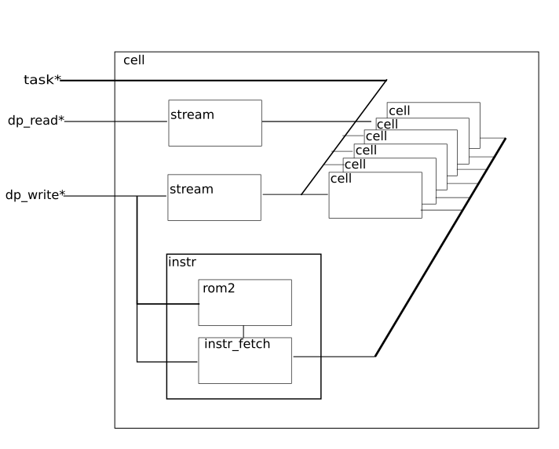

# ZTACHIP Hardware Design Description

This document describes the hardware design of ztachip

## top component

This is the ztachip top component

## pcore 

Array of VLIW processors.

## Tensor Engine

## mcore 

