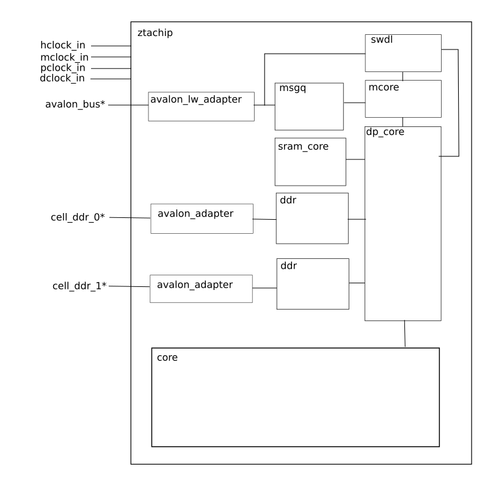
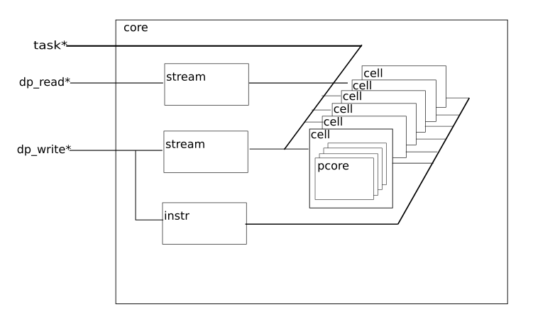
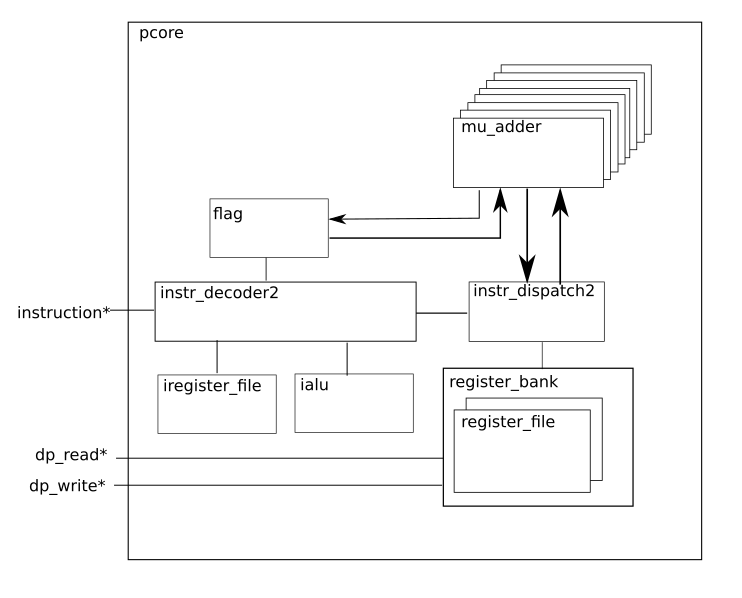
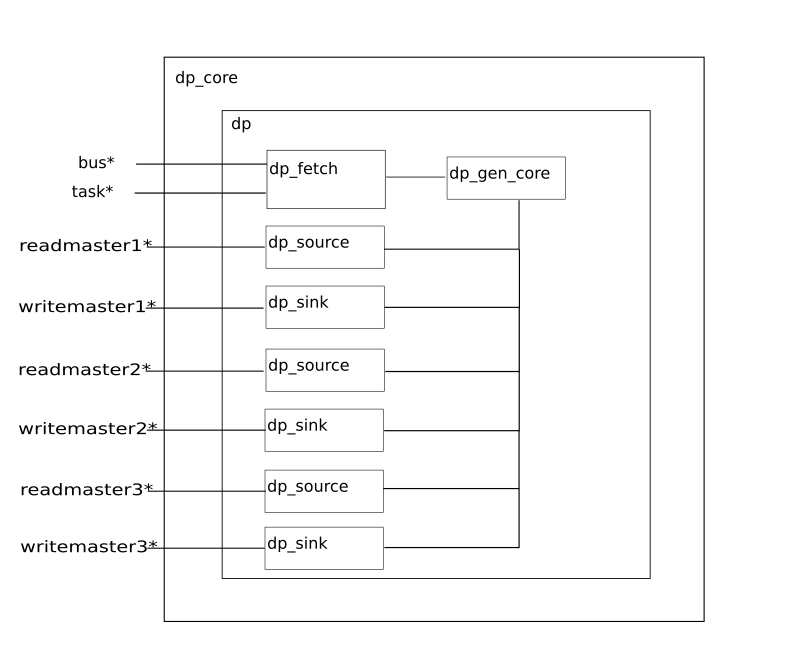
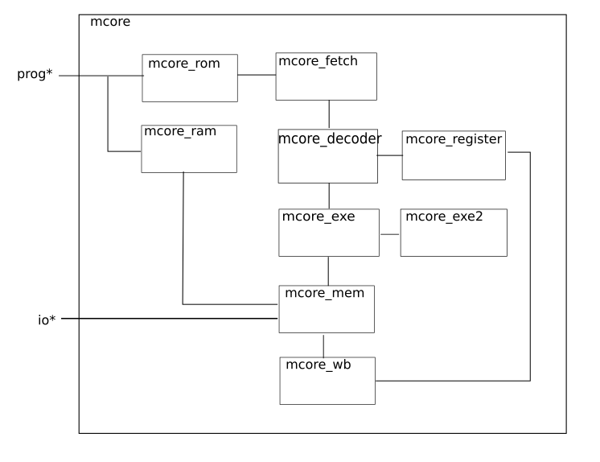

# ZTACHIP Hardware Design Description

This document describes the hardware design of ztachip

## top component

This is the ztachip top component

[ztachip](https://github.com/ztachip/ztachip/blob/master/hardware/HDL/top/ztachip.vhd) - This is the top component

[avalon_lw_adapter](https://github.com/ztachip/ztachip/blob/master/hardware/HDL/top/avalon_lw_adapter.vhd) - Clock bridge between hclock(Host2FPGA bus clock domain) and mclock (mcore clock domain).

[avalon_adapter](https://github.com/ztachip/ztachip/blob/master/hardware/HDL/top/avalon_adapter.vhd) - Interface with Altera Avalon Bus.

[msgq](https://github.com/ztachip/ztachip/blob/master/hardware/HDL/top/msgq.vhd) - Message queue between host and mcore

[mcore](https://github.com/ztachip/ztachip/blob/master/hardware/HDL/mcore/mcore.vhd) - MCORE processor that runs mcore programs. This is a MIPS-I processor.

[dp_core](https://github.com/ztachip/ztachip/blob/master/hardware/HDL/dp/dp_core.vhd) - Tensor Engine

[sram_core](https://github.com/ztachip/ztachip/blob/master/hardware/HDL/top/sram_core.vhd) - SRAM block

[ddr](https://github.com/ztachip/ztachip/blob/master/hardware/HDL/top/ddr.vhd) - DDR interface block. There is one for READ direction and one for write direction)

[core](https://github.com/ztachip/ztachip/blob/master/hardware/HDL/pcore/core.vhd) - Array of VLIW processor cores. These cores execute pcore programs.

hclock_in: Host to FPGA bus clock domain

mclock_in: mcore clock domain

pclock_in: pcore array clock domain

dclock_in: FPGA to DDR bus clock domain

avalon_bus : Host to FPGA bus

cell_ddr_0 : FPGA to DDR read bus

cell_ddr_1 : FPGA to DDR write bus

## pcore 

Array of VLIW processors.

[core](https://github.com/ztachip/ztachip/blob/master/hardware/HDL/pcore/core.vhd) - Array of VLIW processor cores. These cores execute pcore programs.

[stream](https://github.com/ztachip/ztachip/blob/master/hardware/HDL/pcore/stream.vhd) - Stream processor. There are 2 stream processors.One to handle stream processing for data stream from PCORE to TensorEngine. And the other stream processor handles stream processing for data stream from TensorEngine to PCORE.

[cell](https://github.com/ztachip/ztachip/blob/master/hardware/HDL/top/cell.vhd) - PCORE processors are group into groups called cell

[pcore](https://github.com/ztachip/ztachip/blob/master/hardware/HDL/pcore/pcore.vhd) - VLIW/Vector processor 

[instr](https://github.com/ztachip/ztachip/blob/master/hardware/HDL/pcore/instr.vhd) - Generate instructions for PCORE array. This is SIMD architecture so all PCORES process same instruction. 

task: carry tensor operator requests from TensorEngine

dp_read: read bus from PCORE's memory space to TensorEngine

dp_write: write bus from TensorEngine to PCORE's memory space

[mu_adder](https://github.com/ztachip/ztachip/blob/master/hardware/HDL/alu/imu.vhd) - ALU unit for vector arithmetic. 

[instr_decoder2](https://github.com/ztachip/ztachip/blob/master/hardware/HDL/pcore/instr_decoder2.vhd) - Decode instructions, generate commands and memory addresses and forward them to instr_dispatch2. 

[instr_dispatch2](https://github.com/ztachip/ztachip/blob/master/hardware/HDL/pcore/instr_dispatch2.vhd) - Dispatch commands from instr_decoder2 to mu_adder, passing data between mu_adder and register_bank

[iregister_file](https://github.com/ztachip/ztachip/blob/master/hardware/HDL/ialu/iregister_file.vhd) - Hold registers used by scalar processor. 

[ialu](https://github.com/ztachip/ztachip/blob/master/hardware/HDL/ialu/ialu.vhd) - Scalar processor. Mostly used for loop control and address calculation. 

[register_bank](https://github.com/ztachip/ztachip/blob/master/hardware/HDL/pcore/register_bank.vhd) - Hold private/shared memory space for pcores. 

[register_file](https://github.com/ztachip/ztachip/blob/master/hardware/HDL/pcore/register_file.vhd) - There are 2 register_file within a register_bank. Each register_file holds private/shared memory space for each tensor process. 

[flag](https://github.com/ztachip/ztachip/blob/master/hardware/HDL/pcore/flag.vhd) - Hold accumulator and vector comparison results. 

instruction: VLIW instruction to execute tensor operator on PCORE. ztachip has SIMD architecture, and all PCOREs run on the same VLIW instruction.

dp_read: read bus from PCORE memory space to TensorEngine

dp_write: write bus from TensorEngine to PCORE memory space.

## Tensor Engine

[dp_core](https://github.com/ztachip/ztachip/blob/master/hardware/HDL/dp/dp_core.vhd) - Top component for tensorEngine 

[dp_gen_core](https://github.com/ztachip/ztachip/blob/master/hardware/HDL/dp/dp_gen_core.vhd) - Generate addresses for memory cycles. Issue commands to execute tensor operators on pcore array.

[dp_fetch](https://github.com/ztachip/ztachip/blob/master/hardware/HDL/dp/dp_fetch.vhd) - Holds and dispatches mcore instructions from mcore. 

[dp_source](https://github.com/ztachip/ztachip/blob/master/hardware/HDL/dp/dp_source.vhd) - TensorEngine Interface with read bus. 

[dp_sink](https://github.com/ztachip/ztachip/blob/master/hardware/HDL/dp/dp_sink.vhd) - TensorEngine Interface with write bus. 

bus: bus to accept mcore instructions command from MCORE processor

task: signal from pcore array about its process busy status

readmaster1: read bus from PCORE memory space to TensorEngine

writemaster1: write bus from TensorEngine to PCORE memory space.

readmaster2: read bus from SCRATCH memory to TensorEngine

writemaster2: write bus from TensorEngine to SCRATCH memory.

readmaster3: read bus from DDR to TensorEngine

writemaster3: write bus from TensorEngine to DDR.

## mcore 

Implements [classic MIPS architecture](https://www.eecs.harvard.edu/~cs161/notes/mips-part-I.pdf)

[mcore](https://github.com/ztachip/ztachip/blob/master/hardware/HDL/mcore/mcore.vhd) - Top component for mcore 

[mcore_fetch](https://github.com/ztachip/ztachip/blob/master/hardware/HDL/mcore/mcore_fetch.vhd) - Fetching stage of MIPS-I architecture 

[mcore_decoder](https://github.com/ztachip/ztachip/blob/master/hardware/HDL/mcore/mcore_decoder.vhd) - Decoder stage of MIPS-I architecture 

[mcore_exe](https://github.com/ztachip/ztachip/blob/master/hardware/HDL/mcore/mcore_exe.vhd) - EXE stage of MIPS-I architecture 

[mcore_exe2](https://github.com/ztachip/ztachip/blob/master/hardware/HDL/mcore/mcore_exe2.vhd) - EXE stage of MIPS-I architecture for long execution opcode such as division 

[mcore_mem](https://github.com/ztachip/ztachip/blob/master/hardware/HDL/mcore/mcore_mem.vhd) - MEM stage of MIPS-I architecture 

[mcore_wb](https://github.com/ztachip/ztachip/blob/master/hardware/HDL/mcore/mcore_wb.vhd) - WRITEBACK stage of MIPS-I architecture 

[mcore_register](https://github.com/ztachip/ztachip/blob/master/hardware/HDL/mcore/mcore_register.vhd) - Hold MIPS-I register set 

[mcore_rom](https://github.com/ztachip/ztachip/blob/master/hardware/HDL/mcore/mcore_rom.vhd) - Hold instruction codes. 

[mcore_ram](https://github.com/ztachip/ztachip/blob/master/hardware/HDL/mcore/mcore_ram.vhd) - RAM block 

prog: interface to load mcore program

io: external peripheral bus interface.

