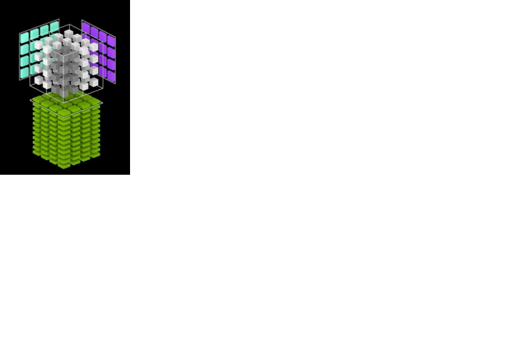

# Concepts

The recent explosion in AI creates an almost limitless demand for computing power.
AI workload is especially challenging since it is demanding in both computing power
and memory bandwidth.

In addition, AI deployed at the edge also demands very low power.

It is generally agreed in the computing community that the way forward is that we
need a special architecture for this kind of workload. This is formally known as
Domain-Specific-Architecture (DSA).

## Challenges

DSA also presents many challenges including

1. DSA is designed for a special set of applications in exchange for higher efficiencies.
However, we would like the DSA domain to be as diverse as possible while still benefiting
from a more efficient hardware implementation.

2. DSA implies both a special hardware and software architecture for a particular domain of applications. 
How can we present DSA concepts without requiring users to have cross-disciplined knowledge? 
It will be difficult to find software engineers that are also knowledgeable in hardware design.

The most common DSA used today is the Systolic-Array (SA). 
SA maps very well to many important math operations required in AI, namely
matrix multiplication, dot product, convolution...

However, SA is also very difficult to program. Users of SA often rely on prebuilt 
libraries provided by hardware vendors. Training/research AI workload that requires custom algorithm
implementation is therefore not suitable for SA.

SA is also not flexible enough to adapt to a wider range of applications. For example,
most ASICs with SA still require a powerful CPU and GPU to perform other 
tasks such as vision preprocessing. For many edge AI applications involving vision, 
the vision preprocessing steps are often just as computing intensive as the AI steps.

## DSA with ztachip

ztachip is an opensourse DSA architecture. It is a novel architecture as far as we
know.

The primary objective for ztachip is to provide DSA that covers a wide range of
applications and not just for AI. DSA programming with ztachip should also be intuitive
and simple.

ztachip targets applications that can be expressed as a sequence of tensor operations.
Tensor operations include data operation and computing operation.

The reason for the above constraints is that we would like data plane operations to be
decoupled from computing operations. This provides many advantages to the hardware
design including

- Memory transfer is streaming with prefetching and without round trip delay

- Tensor data operations specify exactly the data required for later execution. This
eliminates the need for caching.

- Computing operations are presented as tensor operators. This is an intuitive way
to specify algorithm parallelism. Many hardware threads can then be mapped to a large number
of parallel tasks. For example with vector addition, each element-wise addition can be mapped to a thread. 

## What are provided with ztachip

ztachip provides the following DSA components:

- Hardware stack with all the RTL source codes that can be ported to different
FPGA and ASIC.

- A compiler to implement the necessary Domain Specific Language (DSL) to
hide the complexities from users. This means software engineers don't have to know
about the hardware aspects and the same software can then be ported to different
hardware with different capacities with just a recompilation

- Software stack is provided that implements many vision and AI algorithms. Native support
for TensorFlow without retraining is also provided.   

## Results

The 2 metrics of interest are domain coverage and performance.

### Domain converage

For domain coverage, ztachip's DSL has been proven on a wide range of applications
including many vision preprocessing and AI tasks. 

- Image classification with TensorFlow's Mobinet AI model.

- Object detection with TensorFlow's SSD-Mobinet AI model.

- Edge detection using Canny algorithm  

- Color space (RGB/YUYV) conversion

- Equalizer for contrast enhancement

- Guassian convolution for image blurring

- Harris Corder Detection algorithm, commonly used by robotic SLAM also.

- Optical flow algorithm to detect motion

- Image resizing

### Performance and power consumption

Performance is also very promising. Using the popular Mobinet-SSD AI model as a reference point,
ztachip achieves a performance of 10fps at a 20GOPS of hardware computing resource.

Compared with Nvidia Jetson Nano, it has a performance of 40fps but with a computing hardware resource at 500GOPS.

Therefore ztachip has a 6x better computing resource utilization than Nvidia in this case, resulting in much lower
power consumption.

Memory requirements for ztachip are also much lower due to the efficient use of memory.

# Roadmap

ztachip currently is targeting edge AI/Vision applications where performance in the order of hundred of GOPS is
adequate, but power consumption is of primary concern.

To achieve TOPS level of performance, the following extensions can be implemented in a future release.

## ALU arranged in NxN topology.   

ztachip is currently a vector processor and its ALUs arranged in 1xN topology.

ALU units can now be arranged in the tile of NxN units. This is a significant increase in computing
density.

This is a similar approach taken by Nvidia with the introduction of tensor cores.

## Additional level of the memory hierarchy

Current ztachip has only 2 levels of the memory hierarchy, they are...

- External DDR memory 

- On-chip internal memory.

Unlike traditional processor architecture, a Register bank as the lowest level of the memory hierarchy is not required.

However, when implementing ALU in NxN topology, the memory bandwidth between ALU and internal memory can be
quickly overwhelmed. 

Register bank will need to be introduced as the third level of the memory hierarchy. 

These register banks are located next to ALUs. 

These register banks will also have NxN format to match the ALU NxN topology.

## Interconnecting multiple ztachip

Multiple ztachip can be tiled and interconnected over NOC

This is similar to Tesla Dojo architecture.

However, where Tesla Dojo is using SA and VECTOR units at each node for accelerators, 
in our case, ztachip is used instead as an accelerator.

