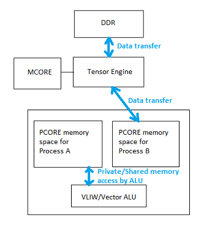
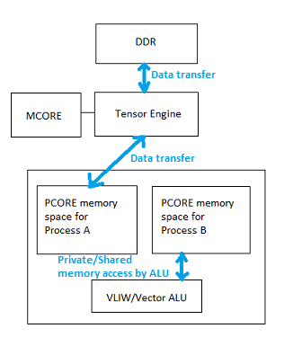

# Software architecture

ztachip software are layered in the following way:

### **pcore programs**

pcore programs run on an array of VLIW processors called pcores.

They implement tensor operators that can be invoked by mcore programs below.

They are vector processors that capable of executing multiple instructions per clock.

pcore programs are files with suffix *.p

[Click here](https://github.com/ztachip/ztachip/blob/master/software/target/apps/nn/kernels/conv.p) for an example of a pcore program implementing convolution operator.

[Click here](https://github.com/ztachip/ztachip/blob/master/Documentation/pcore_programmer_guide.md) for more information on how to program pcore

### **mcore programs**

Program that runs on a MIPS based controller called mcore. 

mcore programs are C programs with special extensions (special extensions begin line with '>') to handle tensor memory operations such as tensor copy,resize,reshape,reordering...

Execution on tensors are invoked by calling tensor operators implemented by pcore programs.

mcore programs are files with suffix *.m

An important concept with mcore programs is that each mcore instructions are associated with a tensor process. There are 2 tensor processes available. There are also seperate PCORE memory space for each process. In a mcore program, there are main thread and child thread and each thread is responsible to dispatch tensor instructions to a seperate tensor process. This concept is important to overlay memory operation from one process with tensor operator execution from the other process. This concept is how ztachip achieves data hiding, for example while PCORE processors are executing a tensor operator using PCORE memory space from process A, tensor engine at the same time can transfer data from DDR to PCORE memory space for process B. And when tensor operator execution is completed for process A and PCORE processors ready to switch to process B, all the data required are already been transfered from DDR to PCORE process B's memory space. Tensor processes are used in all provided examples.

Pictures below illustrates mcore process concept...

Tensor operator operates on Process A, while TensorEngine transfers DDR memory to/from PCORE memory space for Process B.

Now tensor operator operates on Process B, while TensorEngine transfers DDR memory to/from PCORE memory space for Process A.

[Click here](https://github.com/ztachip/ztachip/blob/master/software/target/apps/nn/kernels/conv.m) for an example of mcore program implementing convolution operator.

Together mcore and pcore programs form the ztachip tensor programming paradym

[Click here](https://github.com/ztachip/ztachip/blob/master/Documentation/mcore_programmer_guide.md) for more information on how to program mcore.  

### **graph nodes**

These are C++ objects used by host processor to request executions of mcore+pcore programs above.

Executions are scheduled as a graph.

Graph nodes send requests to mcores as messages to a special hardware queue.

[Click here](https://github.com/ztachip/ztachip/blob/master/software/target/apps/resize/resize.cpp) for example of a graph node implementing interface to image_resize acceleration functions.

[Click here](https://github.com/ztachip/ztachip/blob/master/Documentation/app_programmer_guide.md) for more information on how to use graph.

### **User applications**

User applications use ztachip via graph nodes execution above

[Click here](https://github.com/ztachip/ztachip/blob/master/examples/classifier/classifier.cpp) for example of an application performing Mobinet's image classification using graph.

