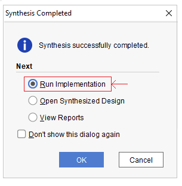
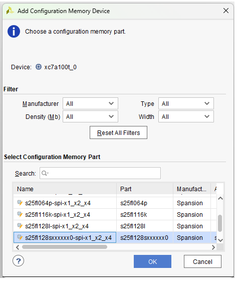
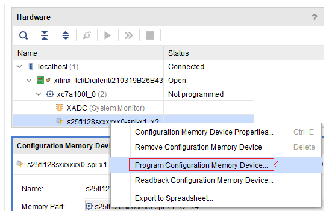

# Installing Vivado Free WebPack Edition.

Vivado WebPack edition is free IDE for the Artix7 FPGA family.

[Installing Vivado WebPack edition](https://www.xilinx.com/support/download.html)

# Create project file

Launch Vivado

On the TCL console command line, issuing the following commands

```
cd <ztachip installation folder>/HW/examples/GHRD
set argv linux # For Linux Only
source create_project.tcl
```

A project file ztachip.xpr should be created after the completion of the execution of create_project.tcl.


# Build and flash procedure. 

Open Vivado project file ztachip/HW/examples/GHRD/ztachip.xpr

Then start with synthesis step as shown below


After systhesis step has been completed, Vivado will prompt you to continue with Implementation step. Choose the option and click OK.



After Implementation step has been completed, Vivado will prompt you to continue with Bitstream Generation step. Choose the option and click OK. 


After Bistream Generation step has been completed, Vivado will prompt you to Open Hardware Manager. Choose the option and click OK.


Make sure your board is connected to PC with provided USB cable by Arty Devlopment package.

From Hardware Manager, connect to target as shown below 


On the left panel, click on "Add Configuration Memory Device" menu option and then choose to create the flash device as shown below



Then program the board as shown below. The image to be flashed is ztachip/HW/examples/GHRD/ztachip.runs/impl_1/main.bin

If the file is not there, verify that -bin option is selected under ProjectSettngs/BitStream and then rerun the BitStream Generation step.



That's it. Your board's FPGA will be programmed with the new image automatically after power reboot.


