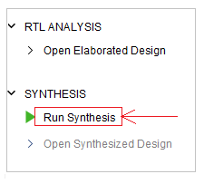
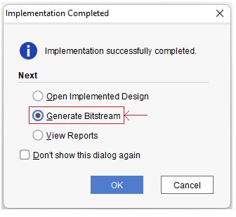
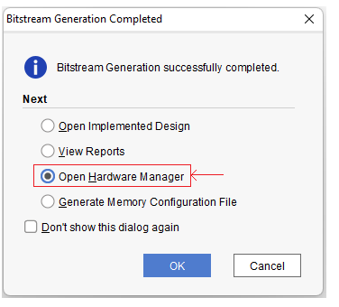
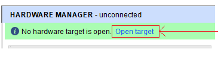

# Installing Vivado Free WebPack Edition.

# Xilinx Vivado FPGA build instructions

Open Vivado project file ztachip/HW/examples/GHRD/GHRD.xpr

Then start with synthesis step as shown below

After systhesis step has been completed, Vivado will prompt you to continue with Implementation step. Choose the option and click OK.

After Implementation step has been completed, Vivado will prompt you to continue with Bitstream Generation step. Choose the option and click OK. 

After Bistream Generation step has been completed, Vivado will prompt you to Open Hardware Manager. Choose the option and click OK.

Now make sure your board is connected to PC with provided USB cable by Arty Devlopment package.

From Hardware Manager, connect to target as shown below 

In the Configuation Memory Device Properties panel, select the right flash chip for your board revision. Reference your Arty-A7 user manual for the information.

Then program the board as shown below.

