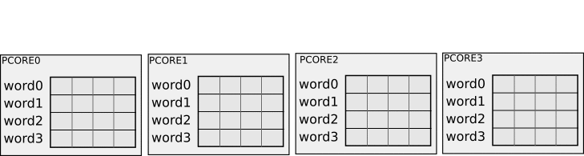
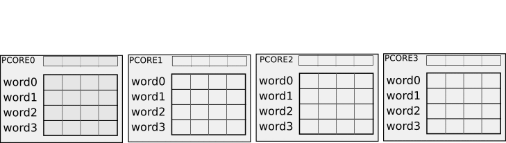
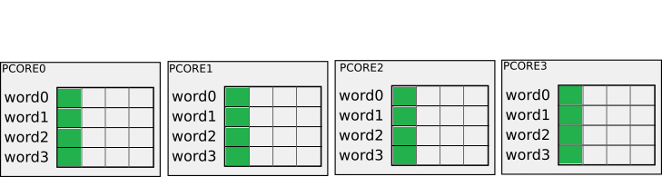

# MCORE Programmer guide

## 1. Prerequisites
To proceed with this document. Please familiar yourself with the software and hardware architecture of ztachip

[ztachip Hardware Architecture](https://github.com/ztachip/ztachip/blob/master/Documentation/HardwareArchitecture.md)

[ztachip Software Architecture](https://github.com/ztachip/ztachip/blob/master/Documentation/SoftwareArchitecture.md)

## 2. Overview

MCORE programs are codes that are executed on MCORE processor. 

The program emits tensor instructions to the Tensor Engine. Tensor instructions perform functions such as tensor data movement,resize,reshape and tensor operator dispatching.

MCORE programs are C programs with embedded tensor syntax extensions. Tensor extensions are lines that begin with '>'.

There can be up to 2 threads running in the MCORE processor. The 2 threads are useful in interleaving memory operation cycle from one thread to tensor operator execution cycle from the other thread. This greatly reduces memory access delay.

## 3. Tensor data objects 

Tensor data objects are objects defined in MCORE programs.

They can be viewed as data variables in MCORE programming paradigm.

Tensors can be resided in PCORE private memory space, PCORE shared memory space, scratch-pad memory space or external DDR memory space.

PCORE memory space is further partitioned into 2 independent process space. This allows for memory operation from TensorEngine to be carried out while tensor operator execution from PCORE arrays can still access memory from the other process space.

### 3.1 Tensor data objects in DDR memory space
External DDR tensor has the syntax below. It specifies a tensor as a subset of another tensor by specifying a dimension index range.
```
   DDR(pointer,dimension,dimension,...)[begin:stride:end][begin:stride:end]...
```
Where:

   - pointer: memory address where TENSOR is stored in DDR memory

   - dimension: TENSOR dimensions

   - begin: starting index of dimension range.

   - stride: stride of the dimension range.

   - end:  ending index of dimension range.


Example:

```
   DDR(p,100,200)[0:1:19][20:1:29]
```
If stride of index range is ignored, then 1 is assumed
```
   DDR(p,100,200)[0:19][20:29]
```
If begin of index range is ignored, then 0 is assumed
```
   DDR(p,100,200)[:19][:29]
```
If end of index range is ignored, then end of dimension range is assumed.
```
   DDR(p,100,200)[0:][20:]
```

### 3.2 Tensor data objects in scratch-pad memory space 
Tensor that is allocated in scratch-pad memory space.

It has similar syntax to DDR tensor syntax except the keyword is SCRATCH

Example:
```
   SCRATCH(p,100,200)[0:19][20:29]

   SCRATCH(p,dy,dx)[y:dy-1][x:dx-1]
```

### 3.3 Tensor data objects in PCORE private memory space

Each PCORE threads have its own private memory space.
PCORE private memory space is further partitioned into 2 independent process space. This allows for memory operation from TensorEngine to be carried out while tensor operator execution from PCORE arrays can still access memory from the other process space.

Tensors that are allocated in PCORE private memory space have the following syntax

```
PCORE(dimension,...)[begin:stride:end][begin:stride:end].thread[begin:stride:end].class::variable
```

Where:

   - dimension: PCORE array can be laid out as an 1D array or 2D array. Dimension must be in power of 2.

   - begin: starting index of dimension range.

   - stride: stride of the dimension range.

   - end: ending index of dimension range.

   - thread: thread block

   - class: class name that variable associated with as defined in associated PCORE programs.

   - variable: class variable holding tensor data elements as defined in associated PCORE programs.
   
Example
```
PCORE(8)[0:7].thread[0:15].class::private_variable[:]

PCORE(4,2)[0:3][0:1].thread[0:15].class::private_variable[:]

PCORE(dy,dx)[0:dy-1][0:dx-1].thread[0:15].class::private_variable[:]

```

### 3.4 Tensor data objects in PCORE shared memory space

PCORE threads in the same PCORE share the same shared memory space. Data allocated in the shared memory can be accessed by any threads in the same PCORE.
PCORE shared memory space is further partitioned into 2 independent process space. This allows for memory operation from TensorEngine to be carried out while tensor operator execution from PCORE arrays can still access memory from the other process space.

Tensors that are allocated in PCORE shared memory space have the following syntax

```
PCORE(dimension,...)[begin:stride:end][begin:stride:end].class::variable
```

Where:

   - dimension: PCORE array can be laid out as an 1D array or 2D array. Dimension must be in power of 2.

   - begin: starting index of dimension range.

   - stride: stride of the dimension range.

   - end: ending index of dimension range.

   - class: class name that variable associated with as defined in associated PCORE program.

   - variable: class variable holding tensor data elements as defined in associated PCORE program.
    
Example
```
PCORE(8)[0:7].class::shared_variable[:]

PCORE(4,2)[0:3][0:1].class::shared_variable[:]

PCORE(4,2)[0:dy-1][0:dx-1].class::shared_variable[:]

```

## 4. Tensor variables.

Tensor variables are tensor alias. Tensor variables are normally used in fast and tight loop of mcore programs.

Example below is an example of a tensor variable

```
   > $coef_pcore := (weightfmt)PCORE(group,groupsz)[:][*].convolution::coef[0:kz-1][:];
```

Whenever $coef_pcore being invoked in a tensor transfer statement, the expression on the right will be substituted in its place.

Tensor variables can also have an optional argument. The argument is being specified at later point whenever tensor variables are used. '$' is tensor variable's argument place holder.

Example below is an example of a tensor variable with argument. The place holder for argument is '$' in the example.

```
   > $coef_ddr := (weightfmt)MEM(coef,botcnt2,topcnt3)[$][rowi:rowi+gkz-1];
```
  
Example below is when the tensor variables above are being used in a tensor transfer instruction. Note that jj substitutes '$' found in tensor variable coef_ddr definition.

```
   > $coef_pcore <= $coef_ddr[jj];
```

## 5. Tensor data memory transfer instructions

MCORE program emits these instructions to TensorEngine.

They are inserted to MCORE C-programs with special syntax line begins with '>'

These instructions move data from one memory space to another.

The way data are read/written to tensors is like a nested FOR loop. The order starts with index from right to left.

In addition to memory transfer, it can also perform tensor reshape,dimension resize,stream processing...

### 5.1 Tensor data transfer from DDR to PCORE private memory space

```
>PCORE[0:1].THREAD[0:1].myclass::myfunc.var[0:1] <= DDR(p)[0:2*2*2-1];
```

Example above transfers data from DDR tensor data object to PCORE tensor data object resided in PCORE private memory space.

The result of the transfer is listed below
```
PCORE   THREAD  private_var      <=  DDR
-----------------------------------------
0       0       private_var[0]       p[0]
0       0       private_var[1]       p[1]
0       1       private_var[0]       p[2]
0       1       private_var[1]       p[3]
1       0       private_var[0]       p[4]
1       0       private_var[1]       p[5]
1       1       private_var[0]       p[6]
1       1       private_var[1]       p[7]
```
### 5.2 Tensor data transfer from DDR to PCORE shared memory space.

```
>PCORE[0:1].myclass::myfunc.shared_var[0:1] <= DDR(p)[0:2*2-1];
```

Example above transfers data from DDR tensor data object to PCORE tensor data object resided in PCORE shared memory space. 

The result of the transfer is listed below
```
PCORE   shared_var    <=   DDR
-------------------------------
0       shared_var[0]      p[0]
0       shared_var[1]      p[1]
1       shared_var[0]      p[2]
1       shared_var[1]      p[3]
```
### 5.3 Tensor data transfer from DDR to SCRATCH-PAD memory space.

```
int len=4;
>SCRATCH(0,100)[0:len-1] <= DDR(p,100)[0:len-1];
```

Example above transfers data from DDR tensor data object to scratch-pad tensor data object.

SCRATCH-PAD tensor is a 1 dimensional tensor of dimension 100.

DDR tensor is a 1 dimensional tensor of dimention 100

The result of the transfer is listed below
```
SCRATCH-PAD      DDR
------------------------
SCRATCH[0]  <=   p[0]
SCRATCH[1]  <=   p[1]
SCRATCH[2]  <=   p[2]
SCRATCH[3]  <=   p[3]
```
### 5.4 Tensor data transfer from DDR to SCRATCH-PAD memory space. Multi-dimensional case.

```
int dx=2;
int dy=4;
>SCRATCH(0,100,200)[0:dy-1][0:dx-1] <= DDR(p,1000,2000)[0:dy-1][0:dx-1];
```

Example above transfers data from DDR tensor data object to scratch-pad tensor data object.

DDR tensor is a 2 dimensional tensor of dimension 1000x2000

Scratch-pad tensor is a 2 dimensional tensor of dimension 100x200

The result of the transfer is listed below
```
SCRATCH-PAD      DDR
------------------------
SCRATCH[0][0] <= p[0][0]
SCRATCH[0][1] <= p[0][1]
SCRATCH[1][0] <= p[1][0]
SCRATCH[1][1] <= p[1][1]
SCRATCH[2][0] <= p[2][0]
SCRATCH[2][1] <= p[2][1]
SCRATCH[3][0] <= p[3][0]
SCRATCH[3][1] <= p[3][1]
```

### 5.5 Tensor reshape

```
>PCORE[0].THREAD[0:2].myclass::myfunc.var[0:3] <= DDR(p,100,2,2)[0][0:2][0:3];
```

Example above transfers data from DDR tensor data object but the DDR dimension indexes are going out-of-bound in some cases.

Tensor data associated with out-of-bound dimension index are padded with zero for read operation and skipped for write operation.

The result of the transfer is listed below
```
PCORE   THREAD    var   <=   DDR
---------------------------------------------------------------------------
0          0        0        p[0][0][0]
0          0        1        p[0][0][1]
0          0        2        p[0][0][2] <- (Out of bound-Replace with zero)
0          0        3        p[0][0][3] <- (Out of bound-Replace with zero)
0          1        0        p[0][1][0]
0          1        1        p[0][1][1]
0          1        2        p[0][1][2] <- (Out of bound-Replace with zero)
0          1        3        p[0][1][3] <- (Out of bound-Replace with zero)
0          2        0        p[0][2][0] <- (Out of bound-Replace with zero)
0          2        1        p[0][2][1] <- (Out of bound-Replace with zero)
0          2        2        p[0][2][2] <- (Out of bound-Replace with zero)
0          2        3        p[0][2][3] <- (Out of bound-Replace with zero)
```

### 5.6 Tensor dimenstion casting

You can cast the dimension of the components of PCORE tensor to different dimension.

Example:

```
>PCORE(8)[:].THREAD[0:15].myclass::myvar[0:15] <= DDR(p)[0:8*16*16-1];
```
recast THREAD component dimension from 16 to 4x4. And recast component myvar dimension from 16 to 4x4
```
>PCORE(8)[:].THREAD(4,4)[0:3][0:3].myclass::myvar(4,4)[0:3][0:3] <= DDR(p)[0:8*16*16-1];
```

### 5.7 Tensor data reordering

The way data are read/written to tensors is like a nested FOR loop.

The order starts with index from right to left.

However, the order can be changed by using FOR directive below. The order starts with index without FOR loop from right to left and then the order continues 
with index associated with FOR directive going from right to left. 

For example:

```
>FOR(K=0:3) FOR(I=0:1) PCORE[0:2].THREAD[I].myclass::myvar[K] <= DDR(p)[0:2*3*4-1];
```

The result of the transfer above is listed below

```
myvar     THREAD        PCORE       <=  DDR
-------------------------------------------- 
  0          0            0             p[0]
  0          0            1             p[1]
  0          0            2             p[2]
  0          1            0             p[3]
  0          1            1             p[4]
  0          1            2             p[5]
  1          0            0             p[6]
  1          0            1             p[7]
  1          0            2             p[8]
  1          1            0             p[9]
  1          1            1             p[10]
  1          1            2             p[11]
  2          0            0             p[12]
  2          0            1             p[13]
  2          0            2             p[14]
  2          1            0             p[15]
  2          1            1             p[16]
  2          1            2             p[17]
  3          0            0             p[18]
  3          0            1             p[19]
  3          0            2             p[20]
  3          1            0             p[21]
  3          1            1             p[22]
  3          1            2             p[23]
```

### 5.8 Tensor scatter transfer

This is one of the key and unique capabilities of ztachip.

SIMD in general is very economical to implement in hardware. But to work efficiently, it requires data to be formatted in vector format.

However this restriction may not match application data format. And also transfering non-vector formatted data is not efficient since transfer cannot be done in vector mode.

Scatter transfer is the solution to this problem by transfering/transforming non-vector formatted data to vector formatted data in an efficient way.

This method is used extensively in the provided vision and AI stack.

#### 5.8.1 Tensor scatter transfer illustration - DDR to PCORE

Animation below illustrates a transfer from DDR to PCORE when it is not possible to do in vector mode since the consecutive data elements are scattered between different words.



But now with the same transfer but with Tensor scatter option enabled. PCOREs now save the vector word into temporary storage before moving each data elements into corresponding words.  We can see now that transfer from DDR to PCOREs can now be done in vector mode.

Scatter operation is performed automatically by TensorEngine and application does not have to be aware of it.



#### 5.8.2 Tensor scatter transfer illustration - PCORE to DDR

Animation below illustrates a transfer from PCORE to DDR when it is not possible to do in vector mode since the consecutive data elements to be read are scattered between different words.



But now with the same transfer but with Tensor scatter option enabled. PCOREs now gather all scattered read into a temporary storage before sending the whole vector to DDR.  We can see now that transfer from PCOREs to DDR can now be done in vector mode.

Scatter operation is performed automatically by TensorEngine and application does not have to be aware of it.


#### 5.8.3 Tensor scatter transfer by vector word.

```
>FOR(I=0:7) PCORE(8)[0:7].THREAD[0:15].myclass::myvar(8,8)[:][I] <= DDR(p)[0:8*16*8*8-1];
```

In example above, transfer units of innermost loop is a vector word (float8) but scattered among consecutive vector words.

This is not efficient since the innerloop takes 8 clocks to complete each float8 vector transfer.

By adding SCATTER(0) directive, the transfer is rearranged and interleaved among all the PCOREs so that the 8-clock cycles required for each unit transfers are overlapped between all the PCOREs. 

This way transfer can still occur in vector mode at rate of 1 vector per clock.

The transfer now becomes...

```
>SCATTER(0) FOR(I=0:7) PCORE(8)[0:7].THREAD[0:15].myclass::myvar(8,8)[:][I] <= DDR(p)[0:8*16*8*8-1];
```

#### 5.8.4 Tensor scatter transfer by thread.

```
>FOR(I=0:7) FOR(J=0:7) PCORE(8)[0:7].THREAD(2,8)[:][:].myclass::myvar[J] <= DDR(p)[0:8*16*8*8-1];
```

In example above, transfer units of innermost loop is a vector word (float8) but scattered among different threads.

This is not efficient since the innerloop takes 8 clocks to complete each float8 vector.

By adding SCATTER(0) directive, the transfer is rearranged and interleaved among all the PCOREs so that the 8-clock cycles required for each unit transfers are overlapped between all the PCOREs. 

This way transfer can still occur in vector mode at rate of 1 vector per clock.

The transfer now becomes...

```
>SCATTER(0) FOR(I=0:7) FOR(J=0:7) PCORE(8)[0:7].THREAD(2,8)[:][:].myclass::myvar[J] <= DDR(p)[0:8*16*8*8-1];
```

### 5.9 Tensor transfer with boundary check disabled.

Normally the dimension index are bounded by the tensor dimension. If index is out-of-bound, then a read operation is padded with zero and a write operation is skipped.

However, you can disable this behaviour by adding '+' after tensor dimension.

Repeat example in 4.5, but now we add '+' after the last 2 dimension of DDR tensor.
 
```
>PCORE[0].THREAD[0:2].myclass::myfunc.var[0:3] <= DDR(p,100,2+,2+)[0][0:2][0:3];
```

Now, indexes of the last 2 dimensions of DDR tensor are no longer used for dimension boundary check. Read/Write access to out-of-bound index are carried out as if the index is valid.

This capability is commonly used to transfer tensors that are partially overlaped.

### 5.10 Tensor transfer with overlapped dimension

Tensor can be defined to have 2 overlapped dimension definitions.

This is useful in-order to add additional boundary checks on the tensor read/write access.

#### 5.10.1 Tensor transfer with overlapped dimension - Usecase 1

```
DDR(p,1000(100,200))[:][:]
```
Tensor above is defined as dimension 100x200 but also as single dimension 1000.

Boundary check is performed on both dimension definitions.
 
In addition to the index boundary check for dimension 100x200, any access beyond the 1000th word are padded with zero for read access and skipped for write access.

This syntax is useful in mapping arbitrary dimensioned tensor in DDR to a tensor in PCORE memory space where tensor dimensions are regular.

#### 5.10.2 Tensor transfer with overlapped dimension - Usecase 2

```
DDR(p,100,32,152(10,16))[:][:][:]
```
Tensor above is defined as dimension 32x10x16 but also as dimension 32x152

Boundary check is performed on both dimension definitions.

For tensor 32x10x16, each element of first index should have size=10x16=160. But because 10x16 sub-tensor is also constrained by 152 in size, therefore, 
the elements of the second index are having size=16 except for the last element which has size=152-(10-1)*16=8.

This syntax is useful in mapping arbitrary dimensioned tensor in DDR to a tensor in PCORE memory space where tensor dimensions are regular.

### 5.11 Tensor padding values

Tensor read/write accesses are checked against dimension boundary. 

Any out-of-bound read accesses are padded with zero by default.

Any out-of-bound write accesses are skipped.

But you can set different padding values for out-of-bound read accesses with PAD keyword.

In example below, any out-of-bound read accesses from DDR tensor are padded with 0xff.
```
>PCORE[0].THREAD[0:2].myclass::myfunc.var[0:3] <= PAD(0xff) DDR(p,100,2,2)[0][0:2][0:3];
```

### 5.12 Tensor data types

Tensors can have the following data types

   - DP_DATA_TYPE_UINT8 : unsigned 8 bit integer

   - DP_DATA_TYPE_INT8  : signed 8 bit integer

   - DP_DATA_TYPE_INT16 : signed 16 bit integer

Data types are specified as first qualifier of the tensor.

Below is an example of tensor transfer in UINT8 format.
```
int fmt=DP_DATA_TYPE_UINT8;
>(fmt)PCORE[0].THREAD[0:2].myclass::myfunc.var[0:3] <= (fmt)PAD(0xff) DDR(p,100,2,2)[0][0:2][0:3];
```

## 6. Tensor operator execution

Tensor operators are functions defined in PCORE programs.

These functions operate on tensors allocated within PCORE memory space.

Input and results associated with tensor operators are then transfered to/from PCORE memory space to/from external DDR or sratch-pad memory space by TensorEngine under the instructions of MCORE program.

### 6.1 Syntax

Example below invokes a tensor operator exe of class convolution defined in corresponding PCORE program

```
> EXE_LOCKSTEP(convolution::exe); 
```

Example below invokes the tensor operator but the execution is limited only to np number of PCORES.

```
> EXE_LOCKSTEP(convolution::exe,np); 
```

Example below invokes tensor operator but the execution is limited only to np number of PCORES and nt number of threads per PCORE.

```
> EXE_LOCKSTEP(convolution::exe,np,nt); 
```

Example below invokes tensor operator in 2 steps. First a function pointer (pointer to function as defined in pcore program) is assigned to a 32-bit integer variable 
and then tensor operator is invoked via this function pointer.

```
uint32_t func;
func=ztamBuildKernelFunc($convolution::exe,np,nt); // Assign function pointer
> EXE_LOCKSTEP(func);
```

## 7 Stream processing

Transfer to/from PCORE memory space can be streamed through a stream processor for processing.

Stream processor performs lookup/interpolation translation from input values to output values. 

The stream processor lookup/interpolation table is constructed by host as described in [Application Programmer Guide](https://github.com/ztachip/ztachip/blob/master/Documentation/app_programmer_guide.md)

There can be 4 stream programs loaded at same time.

Example:
```
> SPU <= (int)MEM(stream,SPU_LOOKUP_SIZE*2)[:];

> PCORE(NP)[0:NP-1].THREAD[0:NT-1].convolution.input[0:7] <= PROC(0) <= DDR(pin)[0:NP*NT*8-1];

> DDR(pout)[0:NP*NT*8-1] <= PROC(1) <= PCORE(NP)[0:NP-1].THREAD[0:NT-1].convolution.output[0:7];
```

Example above loads 2 stream programs from DDR memory. The stream programs are lookup/interpolation tables between input and output values.

In the example, as data being transfered from DDR to PCORE, data is also being processed by stream processor's program #0

And as data being transfered from PCORE to DDR, data is also being processed by stream processor's program #1

## 8. CALLBACK

MCORE instructions to TensorEngine are queued for processing.

CALLBACK construct is used to trigger a function callback whenever MCORE executions have reached a check point.

This is normally used to send back responses to host applications at completion of TensorEngine executions.

### 8.1 Syntax
```
>CALLBACK(callback_function,int parm);
```
Where:

   - callback_function: function to be called whenever TensorEngine execution has reached this point.

   - parm: integer to be passed to callback_function.

## 9. Host communication API

MCORE is communicating with host applications via message queues.

Functions below are API to read/write to/from the message queue.

### 9.1 ztamMsgqReadPointer
Read a DDR memory pointer passed from host applications.

### 9.2 ztamMsgqReadInt
Read a 32-bit interger value passed from host applications.

### 9.3 ztamMsgqWritePointer
Send a DDR memory pointer to host applications.

### 9.4 ztamMsgqWriteInt
Send a 32-bit integer value to host applications.

## 10. Thread management API

MCORE can have 2 processing threads: a main thread and a child thread.

Thread switching is not automatic but manual by calling to ztamTaskYield function below.

Normally, each thread will manage a seperate PCORE process space. 

This way you can interleave between memory cycle and execution cycle of the 2 PCORE processes. That means TensorEngine is setting up/retrieving results from one PCORE memory space 
while PCOREs are executing tensor operators on the other PCORE memory space.


### 10.1 ztamTaskSpawn(void (*func)(void*,int),void *parm,int pid)

To spawn a child thread

Where:

   - func: task entry point function

   - parm: pointer to be passed to task entry point function.

   - pid: 0 for main thread,1 for child thread. 

### 10.2 ztamTaskStatus(int pid)

To check if task has been terminated.

Where:

   - pid: 0 for main main thread, 1 for child thread

### 10.3 ztamTaskYield() 

Yield execution to the other thread.

## 11. Debugging API

### 11.1 ztamPrintf

Display debug formatted string.

This has similar syntax to printf. However it only supports %s and %d within formated string.

For example:

```
ztamPrintf("do matrix_add cnt=%d \n",cnt);
```

### 11.2 Matrix Engine Activity trace

Matrix Engine activity tracing is enabled with directive below...
```
>LOG_ON;
```

Matrix Engine activity tracing can then be disabled with directive below...
```
>LOG_OFF;
```

#### 11.2.1 Example of Tensor Engine Activity report

Below is an example of a Tensor Engine activity output

```
           XX PP SS PP SS DD
           01 WR WR WR WR WR
[       0]    +            +
[       2]    |            | PCORE V8 X1  <= DDR V8 X1 
[     134]    |            | PCORE V8 X1  <= DDR V8 X1 
[     137]    |     +      |
[       2]    |     |      | PCORE V8 X1  <= DDR V8 X1 
[      56]    +     |      |
[       1] +        |      |
[      35] +        |      |
[      42]          |      | PCORE V8 X1  <= DDR V8 X1 
[       2]     +    |     +|
[       2]     |    |     || DDR V8 X1  <= PCORE V8 X1 
[       5]     |    |+    ||
[     141]     +    |+    ||
[       8]          |     |+
[      17]          |     + 
[      52]          +       
[       1]  +               
[       1]  |        +    + 
[       2]  |        |    |  DDR V8 X1  <= PCORE V8 X1 
[      32]  +        |    | 
[       2]     +     |    | 
[     141]     +     +    | 
[       5]                + 
```

#### 11.2.1 Tensor Engine Activity description

Left most column is the delta time elapsed in mcore clock period unit (140MHZ).

Tensor Activity Tracing header has the following meaning...
```
           +------------------- PCORE's process #0 busy status
           |+------------------ PCORE's process #1 busy status
           || +---------------- Write cycles to PCORE memory space from process #0.
           || |+--------------- Read cycles from PCORE memory space from process #0.
           || || +------------- Write cycles to SRATCH memory space from process #0
           || || |+------------ Read cycles from SCRATCH memory space from process #0
           || || || +---------- Write cycles to PCORE memory space from process #1.
           || || || |+--------- Read cycles from PCORE memory space from process #1.
           || || || || +------- Write cycles to SRATCH memory space from process #1
           || || || || |+------ Read cycles from SCRATCH memory space from process #1
           || || || || || +---- Write cycles to DDR memory space (from any process)
           || || || || || |+--- Read cycles from DDR memory space (from any process)
           || || || || || ||

           XX PP SS PP SS DD
           01 WR WR WR WR WR
```

Each tensor transfer activity can have the following attributes
```
   -V8: 8 vector elements transfered per clock

   -V4: 4 vector elements transfered per clock

   -V2: 2 vector elements transfered per clock

   -V1: 1 vector element transfered per clock

   -X1: single precision (UINT8 or INT8)

   -X2: double precision (INT16)

   -SCATTER: transfer is done in scatter mode
```


