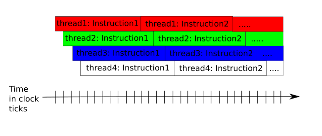

# 1. VLIW Architecture

PCORE processors are based on VLIW architecture.

VLIW is an efficient hardware implementation to achieve instruction level parallelism. 
Each VLIW is composed of a vector operation, a scalar operation and a condition jump operation.

PCOREs also implement multi-threading with zero overhead switching. There are 16 hardware threads per PCORE. VLIW instruction processing are pipelined and interleaved between different threads resulting in a processing throughput of 1 VLIW per clock per PCORE.

Picture below demonstrates VLIW processing pipeline. Each instruction takes 12 clocks to complete. But since they are interleaved between different threads (with zero overhead thread switching in hardware), the effective throughput for VLIW pipeline is one instruction per clock.



## 2. VLIW instruction format

Each VLIW instruction can performed upto 3 operations in 1 clock of the ALU pipeline.

Each VLIW instruction can perform a vector operation, a scalar operation and a conditional jump operation together with all parameter address calculation all in 1 clock.

In sections below, we will compare how C-code are translated to VLIW assembly. You can also view VLIW assembly from your pcore compilation by uncommenting VERBOSE=y directive in ztachip/software/target/builds/Makefile.kernels

### 2.1 Vector operation

Perform operations in vector such as addition,multiplicaton,Multiply-Accumulate,shift.

Operation input and output are from PCORE memory space.

Addressing for input and output parameters can be of the following modes below...

#### 2.1.1 Direct addressing

C-code
```
   z=x+y;
```
VLIW-assembly
```
   MU> z@16(v)=x@0(v) ADD y@8(v)
```

Examble above, z is at memory address 16, x variable is at memory address 0 and y is at memory address 8

Operation is vector addition.

#### 2.1.2 Direct addressing + integer variable

C-code
```
   z[i]=x[i]+y[i];
```
VLIW assembly
```
   MU> z@32[i@0](v)=x@0[i@0](v) ADD y@16[i@0](v)
```

Example above, z is at memory address 32+i, x address is at memory address 0+i and y is at memory address 16+i

Operation is vector addition.

Integer variable i is mapped to R0

And all these operations (addressing calculation and vector operation) are executed together as 1 clock instruction.

#### 2.1.3 Direct addressing + integer variable + constant

C-code
```
   z[i+1]=x[i+2]+y[i+3];
```
VLIW assembly
```
   MU> z@32[i@0+1](v)=x@0[i@0+2](v) ADD y@16[i@0+3](v)
```

Example above, z is at memory address 32+i+1, x address is at memory address 0+i+2 and y is at memory address 16+i+3

Operation is vector addition.

Integer variable i is mapped to R0

And all these operations (addressing calculation and vector operation) are executed together as 1 clock instruction.

#### 2.1.4 Pointer variable + constant

C-code
```
   p1[1]=p2[2]+p2[3];
```
VLIW assembly
```
   MU> p:p1@0[1](v)=p:p2@1[2](v) ADD p:p2@1[3](v)
```

Example above, output parameter is at memory address referenced by pointer type variable p1 then plus constant 1. 

First input parameter is at memory address referenced by pointer type variable p2 then plus constant 2.

Second input parameter is at memory address referenced by pointer type variable p2 then plus constant 3.

Pointer variable p1 is mapped to P0

Pointer variable p2 is mapped to P1 

And all these operations (addressing calculation and vector operation) are executed together as 1 clock instruction.

#### 2.1.5 Pointer variable + integer variable

C-code
```
   p1[i]=p2[i]+p2[i];
```
VLIW assembly
```
   MU> p:p1@0[i@0](v)=p:p2@1[i@0](v) ADD p:p2@1[i@0](v)
```

Example above, output parameter is at memory address referenced by pointer type variable p1 then plus integer variable i.

First input parameter is at memory address referenced by pointer type variable p2 then plus integer variable i.

Second input parameter is at memory address referenced by pointer type variable p2 then plus integer variable i.

Pointer variable p1 is mapped to P0

Pointer variable p2 is mapped to P1

Integer variable i is mapped to R0

And all these operations (addressing calculation and vector operation) are executed together as 1 clock instruction.

#### 2.1.6 Pointer variable + integer variable + constant

C-code
```
   p1[i]=p2[i+1]+p2[i+2];
```
VLIW assembly
```
   MU> p:p1@0[i@0](v)=p:p2@1[i@0+1](v) ADD p:p2@1[i@0+2](v)
```

Example above, output parameter is at memory address referenced by pointer type variable p1 then plus integer variable i.

First input parameter is at memory address referenced by pointer type variable p2 then plus integer variable i then plus constant 1.

Second input parameter is at memory address referenced by pointer type variable p2 then plus integer variable i then plus constant 2.

Pointer variable p1 is mapped to P0

Pointer variable p2 is mapped to P1

Integer variable i is mapped to R0

And all these operations (addressing calculation and vector operation) are executed together as 1 clock instruction.


### 2.2 Scalar operation

PCORE also has a scalar processor to perform arithmetic on scalar variables.

Scalar operations are typically used for address calculation and loop counter.

C-code
```
   p1[i]=2*p2[i];
   i++;
   p1[i]=2*p2[i];
```
VLIW instruction
```
[0x55c89eb321f0]
   MU> p:p1@0[i@0+0](v)=2.000000000000 MUL p:p2@1[i@0+0](v)
   IMU> int:i@0=int:i@0 ADD 1
[0x55c89eb32a20]
   MU> p:p1@0[i@0+0](v)=2.000000000000 MUL p:p2@1[i@0+0](v)
```

In example above...

First VLIW instrution is composed of both vector multiplication operation and a scalar addition. This is an example of 2 operations per clock.

Second VLIW instruction is composed of just vector multiplication operation.

### 2.3 Conditional operation.

C-code
```
   for(i=3;i >= 0;i--)
   {
      z[i]=x[i]+y[i];
   }
```
VLIW instruction for the for loop
```
   [0x5654cce39290]
      MU> z@32[i@3+0](v)=x@0[i@3+0](v) ADD y@16[i@3+0](v)
      IMU> int:i@3=int:i@3 SUB 1
      CTL> OPCODE_JUMP_GE after=0 addr=0x5654cce39290
```
In example above, the C for loop is compiled into just a single VLIW instruction that takes just 1 clock of the ALU pipeline. The VLIW instruction performs the vector operation together with all parameter address calculation, update the index counter i and then loop back to repeat the same instruction again until index i becomes negative.

# 3. CONCLUSIONS

ztachip VLIW is effective by partitioning vector operation from scalar operation.

Vector operations are the one responsible for computation.

Scalar operations are the one responsible for functions such as address calculation, loop counter...

Also all address calculaton (direct or indirect) are also included together with the same VLIW instruction.

Compared to standard assembly, there is also no memory load and store operation since all memory required are already moved to PCORE memory space by TensorEngine at the instruction of mcore program.

From example above, we can see a single VLIW instruction can be equivalent to more than 10 standard assembly instructions (if including memory calculation and memory load/store)

Convolution operator was shown to operate at >90% efficiency (including memory access overhead) with ztachip VLIW.

