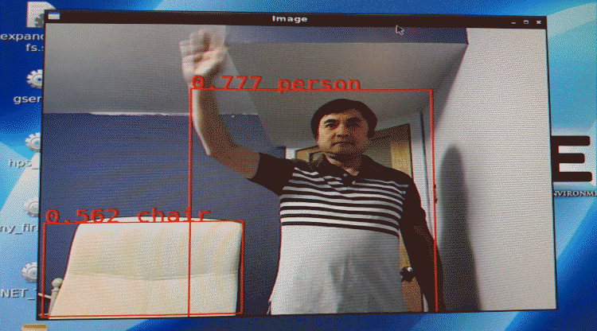
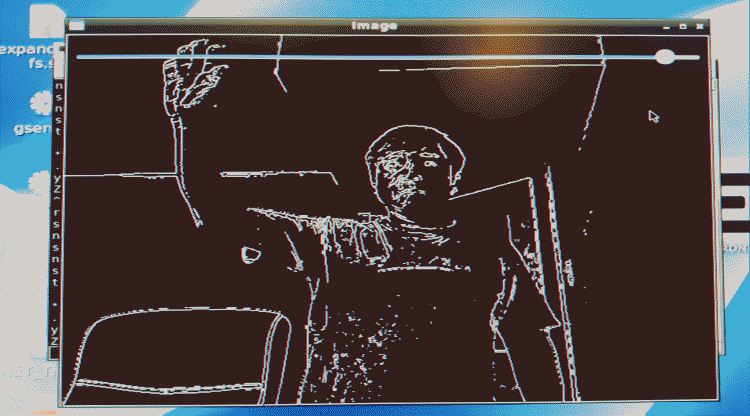
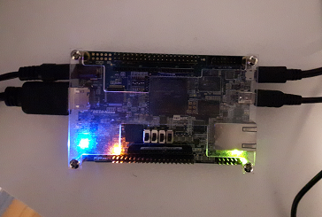

# Introduction

ztachip is an opensource framework for Domain Specific Architecture. 

Domain Specific Architecture defines the hardware/software architectures that can accelerate a particular class of applications very efficiently. The class of applications that ztachip accelerates today are AI and vision processing tasks.

ztachip has the full hardware implementation available in VHDL source code.

ztachip hardware can be deployed to FPGA hardware or custom ASIC.

ztachip is fully software programmable by using a special tensor programming paradigm. 

Unlike many other AI hardware architectures, ztachip is flexible enough to run not just neural-network functions, but also a wide range of image processing such as image resizing, edge detection, image blurring, optical flow, harris corner feature extraction,...  

# Demonstration 

Run objectDetection,edgeDetection,motionDetection and featureOfInterest extraction together at same time.

Run object detection using SSD-MobiNetv1.0 from Google TensorFlowLite (no retraining required)

Run image classfication using MobiNetv2.0 from Google TensorFlowLite (no retraining required)

Run Edge detection

Run HarrisCorner feature of interest extraction

This demonstration runs on [DE10_NANO FPGA board](https://www.terasic.com.tw/cgi-bin/page/archive.pl?Language=English&CategoryNo=165&No=1046)

# Getting started 

**Ztachip Build Procedure**

   - [Software Build Procedure](https://github.com/ztachip/ztachip/blob/master/Documentation/BuildProcedure.md)

   - [FPGA Build Procedure](https://github.com/ztachip/ztachip/blob/master/Documentation/HardwareBuildProcedure.md)

**Ztachip Architecture - How it works**

   - [ztachip Hardware Architecture](https://github.com/ztachip/ztachip/blob/master/Documentation/HardwareArchitecture.md)

   - [ztachip Software Architecture](https://github.com/ztachip/ztachip/blob/master/Documentation/SoftwareArchitecture.md)

**Programmers Guide - How to program ztachip**

   - [PCORE Programmer Guide](https://github.com/ztachip/ztachip/blob/master/Documentation/pcore_programmer_guide.md)

   - [MCORE Programmer Guide](https://github.com/ztachip/ztachip/blob/master/Documentation/mcore_programmer_guide.md)

   - [Application Programmer Guide](https://github.com/ztachip/ztachip/blob/master/Documentation/app_programmer_guide.md)

**AI stack - How to build AI applications with ztachip**

   - [AI Stack Programmer Guide](https://github.com/ztachip/ztachip/blob/master/Documentation/ai_programmer_guide.md)

**Vision stack - How to build embedded vision applications with ztachip**

   - [Vision Stack Programmer Guide](https://github.com/ztachip/ztachip/blob/master/Documentation/vision_programer_guide.md)

# Conclusions

I created this project as a community project for us to experiment on some research idea in the area of Domain Specific Architecture.

So how ztachip measured up against other solutions? Is it worth while to continue? 

In my opinion, it is promising. Click [here](https://github.com/ztachip/ztachip/blob/master/Documentation/conclusion.md) for result analysis.

Please send me your feedback comments and ideas. Much appreciated.

# Copyright and license 

Copyright: Vuong Nguyen (vuongdnguyen@hotmail.com) For licensing details please visit [LICENSE.md](https://github.com/ztachip/ztachip/blob/master/LICENSE.md)

