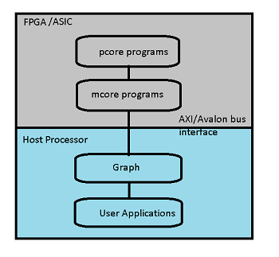

# Introduction

ztachip is an opensource framework to build both AI hardware and software. 

ztachip has the full hardware implementation available in VHDL source code.

ztachip hardware can be deployed to FPGA hardware or custom ASIC.

ztachip is fully software programmable by using a special tensor programming paradigm. 

The hardware does not have to be rewire for different applications, making ztachip ideal for porting to ASIC due to its low logic gate counts.

Unlike many other AI acceleration architectures, ztachip is flexible enough to run not just neural-network functions, but also a wide range of image processing such as image resizing, edge detection, image blurring, optical flow, harris corner feature extraction,...  

Run objectDetection,edgeDetection,motionDetection and featureOfInterest extraction together at same time.

# Hardware architecture

ztachip hardware architecture is composed of the following components

### **pcores**

ztachip has an array of light weight processors (pcores).

pcore has VLIW (very long instruction word) architecture. This allows for multiple instructions to be executed per clock cycle.

pcore is also a vector processor, capable of wide vector operations.

Each pcore has 16 hardware threads capable of zero-overhead task switching done in hardware.

Each pcore has a shared memory space that is shared among all the 16 threads.

Each thread also has its own private memory space.

pcore memory space is further partitioned into 2 seperate process space. This allows for memory cycle to one process to overlap with execution cycle on the other process.

### **mcore**

Processor (MIPS based) that dispatches high level tensor instructions to Tensor Engine.

Tensor instructions sent to Tensor Engine include instructions to do complex tensor data transfer and tensor operator requests to be executed by pcore array.

There can be 2 threads running on mcore. This allows for one thread memory cycles to overlap with the other thread execution cycles.

This helps ztachip achieves good computing efficiency.

NeuralNet convolution is executed with 90% efficiency compared with peak performance.

### **Tensor engine**

Special hardware block that executes high level tensor instructions that are dispatched from mcore.

Tensor instructions performed by Tensor Engine are:

- Complex tensor data transfer such as tensor reshape,resize,reorder,scatter-gather transfer. 

- Schedules pcore array to perform tensor operators.

- Coordinate data transfer between scratch-pad memory, pcore memory and external memory. 

### **Stream processor**

There is a stream processor that intercepts data transfer between pcore arrays and external memory bus.

This allows for streaming operations to be applied to data read/written to external memory.

Stream processor can implement arbitrary non-linear processing via table lookup.

# Software architecture

ztachip software are layered in the following way:

### **pcore programs**

pcore programs run on an array of VLIW processors called pcores.

They implement tensor operators that can be invoked by mcore programs below.

They are vector processors that capable of executing multiple instructions per clock.

pcore programs are files with suffix *.p

[Click here](https://github.com/ztachip/ztachip/blob/master/software/target/apps/nn/kernels/conv.p) for an example of a pcore program implementing convolution operator.

[Click here](https://github.com/ztachip/ztachip/blob/master/Documentation/pcore_programmer_guide.md) for more information on how to program pcore

### **mcore programs**

Program that runs on a MIPS based controller called mcore. 

mcore programs are C programs with special extensions (special extensions begin line with '>') to handle tensor memory operations such as tensor copy,resize,reshape,reordering...

Execution on tensors are invoked by calling tensor operators implemented by pcore programs.

mcore programs are files with suffix *.m

[Click here](https://github.com/ztachip/ztachip/blob/master/software/target/apps/nn/kernels/conv.m) for an example of mcore program implementing convolution operator.

Together mcore and pcore programs form the ztachip tensor programming paradym

[Click here](https://github.com/ztachip/ztachip/blob/master/Documentation/mcore_programmer_guide.md) for more information on how to program mcore.  

### **graph nodes**

These are C++ objects used by host processor to request executions of mcore+pcore programs above.

Executions are scheduled as a graph.

Graph nodes send requests to mcores as messages to a special hardware queue.

[Click here](https://github.com/ztachip/ztachip/blob/master/software/target/apps/resize/resize.cpp) for example of a graph node implementing interface to image_resize acceleration functions.

[Click here](https://github.com/ztachip/ztachip/blob/master/Documentation/app_programmer_guide.md) for more information on how to use graph.

### **User applications**

User applications use ztachip via graph nodes execution above

[Click here](https://github.com/ztachip/ztachip/blob/master/examples/classifier/classifier.cpp) for example of an application performing Mobinet's image classification using graph.

