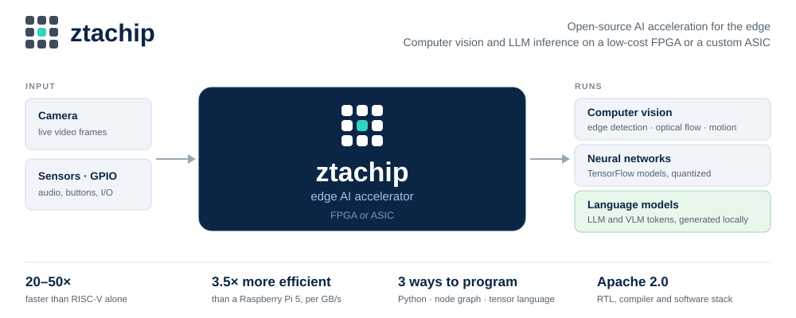

# ztachip

**An open-source AI accelerator for edge devices — computer vision and LLM inference on a low-cost FPGA or a custom ASIC**

ztachip is an AI accelerator you can build yourself. Attach a camera and a VGA
display to an Artix-7 development board, load the image, and it runs real
workloads: edge detection, optical flow, motion detection and colour conversion,
TensorFlow models, and small language models generating text locally, with
nothing sent to a server.

An FPGA is where you start, not where you have to stop. The RTL is generic VHDL
with no vendor-specific primitives, so the same design can go into a custom
**ASIC**, or a larger FPGA, or an SoC alongside your own logic — porting means
mapping six small memory primitives to the new target and setting the core count
to match the silicon you have.

What makes it interesting is efficiency rather than peak speed. AI inference at
the edge is limited by memory bandwidth, not compute — the cores spend most of
their time waiting for model weights to arrive from memory. ztachip is built
around moving that data well, which is what *data-aware* means in practice. It
delivers **6.70 tokens per second for every GB/s of memory bandwidth, 3.5× what a
Raspberry Pi 5 achieves**, and runs vision and AI workloads **20–50× faster** than
the same RISC-V processor without it.

It is also general-purpose within its domain. Most accelerators handle one narrow
class of workload; ztachip runs classical computer vision, neural-network
inference and transformer models on the same hardware, through the same
programming model.

There are three ways to program it, and you can start with the easiest: a few
lines of MicroPython, a graph of ready-made processing nodes, or the tensor
language directly, where you control how data moves through memory and how the
cores work on it.

Everything is open source under the Apache 2.0 license — RTL, compiler, software
stack and demos.

[▶ Watch the demo video](https://www.youtube.com/watch?v=ng0nCEYE6fc&t=499s)

---

# Documentation

See the **[ztachip Documentation](https://ztachip.github.io/)** for the technical overview, hardware architecture, programmer's guides and the MicroPython interface.

---

# Getting Started

**[Getting started with the demo on Artix-7 FPGA](https://ztachip.github.io/GettingStarted.html)** —
build the software and the FPGA image, connect the camera and VGA modules to a
Digilent Arty A7 board, and run the vision and LLM demos. The guide also reports
the benchmark results measured on that board.

The Arty A7 is the reference platform, not the only one. The same guide covers
the other two ways to run ztachip:

- **Porting to another FPGA, ASIC or SoC** — what to change in the hardware stack
  (platform configuration, wrapper library, top-level component) and in the
  software stack (core count, linker file, boot loader, peripheral drivers).
- **Running in simulation** — build the simulation image and run the example test
  programs under an RTL simulator, with no hardware at all.

---

# Contact

ztachip is free to use as an open-source project.

For technical questions, bug reports, feature requests, or general discussion, please open an **Issue** or start a **Discussion** on GitHub.

For business consulting and support, please [contact us](mailto:vuongdnguyen@hotmail.com?subject=Ztachip%20Support).

Follow ztachip on [Twitter](https://twitter.com/ztachip).
