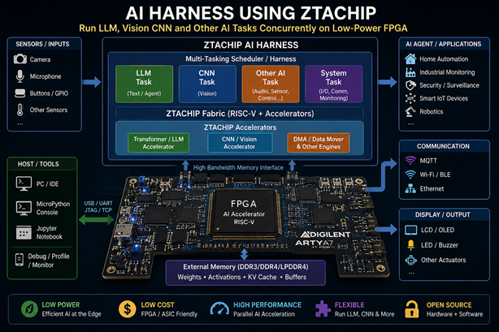
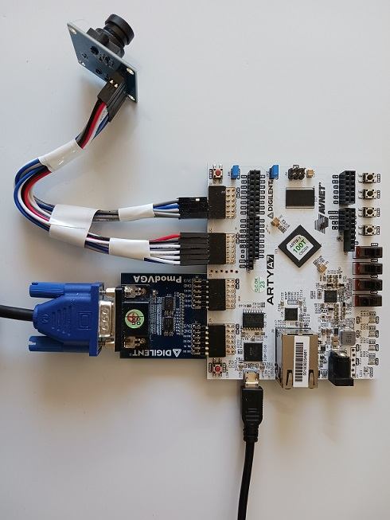
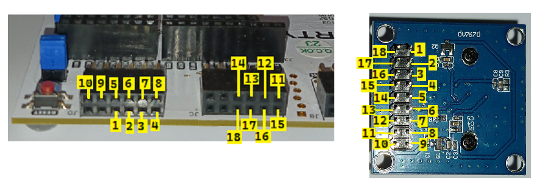

# ztachip

**A Multicore, Data-Aware, Embedded RISC-V AI Accelerator for Edge Inference**

ztachip is a multicore, data-aware embedded RISC-V AI accelerator designed for edge inference on low-end FPGAs and custom ASICs.

ztachip can deliver **20–50× acceleration** over non-accelerated RISC-V implementations on many vision and AI workloads, including LLM inference. It can also outperform RISC-V processors equipped with vector extensions.

Its innovative tensor processor accelerates a broad range of workloads—from traditional computer-vision operations such as edge detection, optical flow, motion detection, and color conversion to TensorFlow AI models and LLM inference. Unlike accelerators designed for only a narrow class of applications, ztachip provides a more general-purpose acceleration architecture for edge AI and vision workloads.

A new tensor programming paradigm enables developers to efficiently exploit the massive processing and data parallelism available in the ztachip architecture.

[▶ Watch the demo video](https://www.youtube.com/watch?v=ng0nCEYE6fc&t=499s)



---

## Table of Contents

- [Documentation](#documentation)
- [Software Build Procedure](#software-build-procedure)
  - [Prerequisites](#prerequisites-ubuntu)
  - [RISC-V Toolchain](#download-and-build-the-risc-v-toolchain)
  - [Download ztachip](#download-ztachip)
  - [Build ztachip](#build-ztachip)
  - [MicroPython Integration](#micropython-integration-recommended)
- [FPGA Build Procedure](#fpga-build-procedure)
- [Running the Demos](#running-the-demos)
  - [Preparing the Hardware](#preparing-the-hardware)
  - [Opening the Serial Port](#open-the-serial-port)
  - [Building OpenOCD](#download-and-build-openocd)
  - [Launching OpenOCD](#launch-openocd)
  - [Demo Preparation](#demo-preparation)
  - [Uploading the Software Image](#upload-the-software-image-with-gdb)
  - [Starting the Image Transfer](#start-the-image-transfer)
  - [Running the Program](#run-the-program)
- [Benchmark](#benchmark)
- [Porting ztachip](#porting-ztachip-to-other-fpgas-asics-and-socs)
- [Running ztachip in Simulation](#run-ztachip-in-simulation)
- [Contact](#contact)

---

# Documentation

See the **[ztachip Documentation](https://ztachip.github.io/ztachip/)** for the technical overview, hardware architecture, programmer's guides and the MicroPython interface.

The same documents are also readable [in this repository](Documentation/index.md).

---

# Software Build Procedure

## Prerequisites (Ubuntu)

Install the required Ubuntu packages:

```bash
sudo apt-get install autoconf automake autotools-dev curl python3 \
    libmpc-dev libmpfr-dev libgmp-dev gawk build-essential \
    bison flex texinfo gperf libtool patchutils bc \
    zlib1g-dev libexpat-dev python3-pip

pip3 install numpy
```

---

## Download and Build the RISC-V Toolchain

### Option 1 — Use the Prebuilt Toolchain

Download the prebuilt RISC-V [toolchain](https://github.com/ztachip/ztachip/releases/download/AI_agents/riscv.tar.gz).

Then extract it into `/opt`:

```bash
sudo tar -xzvf riscv.tar.gz -C /
```

The toolchain will be installed under:

```text
/opt/riscv
```

### Option 2 — Build the Toolchain from Source

If you prefer to build the RISC-V GNU toolchain yourself:

```bash
export PATH=/opt/riscv/bin:$PATH

git clone https://github.com/riscv/riscv-gnu-toolchain
cd riscv-gnu-toolchain

./configure --prefix=/opt/riscv --with-arch=rv32im --with-abi=ilp32

sudo make
```

---

## Download ztachip

Clone the ztachip repository:

```bash
git clone https://github.com/ztachip/ztachip.git
```

---

## Build ztachip

Add the RISC-V toolchain to your path and build the ztachip compiler, file system, kernels, and software image:

```bash
export PATH=/opt/riscv/bin:$PATH

cd ztachip

cd SW/compiler
make clean all

cd ../fs
python3 bin2c.py

cd ..
make clean all -f makefile.kernels
make clean all
```

---

## MicroPython Integration (Recommended)

ztachip can run under MicroPython, providing a Python programming interface for accessing ztachip functionality.

See the [MicroPython Programmer's Guide](micropython/MicropythonUserGuide.md) for more information.

To build ztachip with MicroPython:

```bash
git clone https://github.com/micropython/micropython.git

cd micropython/ports

cp -avr <ztachip installation folder>/micropython/ztachip_port .

cd ztachip_port

export PATH=/opt/riscv/bin:$PATH
export ZTACHIP=<ztachip installation folder>

make clean
make
```

---

# FPGA Build Procedure

The reference FPGA implementation uses Xilinx Vivado.

1. Download the free **Xilinx Vivado WebPACK** edition.
2. Create the Vivado project, build the FPGA image, and program it into flash by following the [FPGA Build Procedure](Documentation/Vivado.md).

---

# Running the Demos

## Preparing the Hardware

The reference design requires the following hardware components:

- [Digilent Arty A7-100T development board](https://digilent.com/shop/arty-a7-artix-7-fpga-development-board/)
- [Digilent Pmod VGA module](https://digilent.com/shop/pmod-vga-video-graphics-array/)
- [Camera module](https://www.aliexpress.com/item/1005009373256992.html?src=google&src=google&albch=shopping&acnt=603-455-9033&isdl=y&slnk=&plac=&mtctp=&albbt=Google_7_shopping&aff_platform=google&aff_short_key=_oFgTQeV&gclsrc=aw.ds&albagn=888888&ds_e_adid=&ds_e_matchtype=&ds_e_device=c&ds_e_network=x&ds_e_product_group_id=&ds_e_product_id=en1005009373256992&ds_e_product_merchant_id=5445730461&ds_e_product_country=CA&ds_e_product_language=en&ds_e_product_channel=online&ds_e_product_store_id=&ds_url_v=2&albcp=23541693768&albag=&isSmbAutoCall=false&needSmbHouyi=false&gad_source=1&gad_campaignid=23546808899&gbraid=0AAAABCRFad9mvAHB4TSXwyJe-26kItMYF&gclid=CjwKCAjw1bvTBhBbEiwAzbP8L7uGk2ZsaMEruqJy88fXzSv_ymCxoNGRwqF0V9_r31PD_ODI-n-FORoCH2MQAvD_BwE)

Attach the VGA and camera modules to the Arty A7 board as shown below.



Connect the camera module to the Arty A7 board as shown below.



---

## Open the Serial Port

When running the ztachip MicroPython image, connect to the serial port provided through the Arty A7 USB interface.

Serial-port flow control must be disabled.

For example:

```bash
sudo minicom -w -D /dev/ttyUSB1
```

> **Note:** After connecting to the serial port for the first time, reset the board by pressing the button next to the USB port. Wait for the green LED to turn on. The USB serial interface must be the first device to connect to USB before ztachip.

---

## Download and Build OpenOCD

OpenOCD provides the JTAG connection used by the GDB debugger.

In this example, the program is loaded onto the board using **GDB + JTAG**.

Install the required packages:

```bash
sudo apt-get install libtool automake libusb-1.0.0-dev \
    texinfo libusb-dev libyaml-dev pkg-config
```

Download and build OpenOCD:

```bash
git clone https://github.com/SpinalHDL/openocd_riscv

cd openocd_riscv

./bootstrap
./configure --enable-ftdi --enable-dummy

make
```

Copy the ztachip OpenOCD configuration files into the OpenOCD directory:

```bash
cp <ztachip installation folder>/tools/openocd/soc_init.cfg .
cp <ztachip installation folder>/tools/openocd/usb_connect.cfg .
cp <ztachip installation folder>/tools/openocd/xilinx-xc7.cfg .
cp <ztachip installation folder>/tools/openocd/jtagspi.cfg .
cp <ztachip installation folder>/tools/openocd/cpu0.yaml .
```

---

## Launch OpenOCD

Make sure the **green LED below the reset button near the USB connector is on**. This indicates that the FPGA has been configured correctly.

Then launch OpenOCD to provide the JTAG connection for GDB:

```bash
cd <openocd_riscv installation folder>

sudo src/openocd \
    -f usb_connect.cfg \
    -c 'set MURAX_CPU0_YAML cpu0.yaml' \
    -f soc_init.cfg
```

Keep OpenOCD running while using GDB.

---

## Demo Preparation

The demo requires LLM model files to be available.

A **TFTP server** must be running on the PC Ethernet interface connected to the Arty A7 board.

Configure the PC Ethernet interface with the following IP address:

```text
10.10.10.10
```

Copy the following two model files into the TFTP server's download directory:

- [SMOLLM2.ZUF](https://github.com/ztachip/ztachip/releases/download/AI_agents/SMOLLM2.ZUF)
- [SMOLFC.ZUF](https://github.com/ztachip/ztachip/releases/download/AI_agents/SMOLFC.ZUF)

These files contain quantized versions of the LLM models.

See the [Model Quantization Procedure](Documentation/QuantizeProcedure.md) for instructions on creating the quantized models.

---

## Upload the Software Image with GDB

### Bare-Metal Mode

To run ztachip without MicroPython integration, open another terminal and start GDB with the standalone ztachip software image:

```bash
export PATH=/opt/riscv/bin:$PATH

cd <ztachip installation folder>/SW/src

riscv32-unknown-elf-gdb ../build/ztachip.elf
```

### MicroPython Mode (Recommended)

To run ztachip with MicroPython integration, open another terminal and start GDB with the MicroPython firmware image:

```bash
export PATH=/opt/riscv/bin:$PATH

cd <MicroPython installation folder>/ports/ztachip_port

riscv32-unknown-elf-gdb ./build/firmware.elf
```

---

## Start the Image Transfer

From the GDB prompt, enter:

```gdb
set pagination off
target remote localhost:3333
set remotetimeout 60
set arch riscv:rv32
monitor reset halt
load
```

---

## Run the Program

After the program has been successfully loaded, run it from the GDB prompt:

```gdb
continue
```

If running in bare-metal mode, press any button to move between different vision/LLM demos.

If running in micropython mode, at serial console, hit CTRL+E and then paste one of the python programs from this [folder](micropython/examples) and then hit CTRL+D to run. Then hit any button to stop and return to python console. 

A demonstration showing how to run the demo is available in this [video](https://www.youtube.com/watch?v=ng0nCEYE6fc&t=499s).

---

# Benchmark

Small LLM inference performance on edge devices is largely constrained by **memory bandwidth**. In these scenarios, additional compute capability provides limited benefit when processing cores spend most of their time waiting for model data to be transferred from memory.

For this reason, a useful metric for comparing edge LLM implementations is:

**Tokens per second (TPS) per GB/s of memory bandwidth**

## Benchmark Results

The following results compare **ztachip running on the Arty platform** with the Raspberry Pi 4 and Raspberry Pi 5.

LLM inference performance can be divided into two main components:

- **Fixed component:** Dominated by matrix multiplication and model-weight transfers. This represents the primary bottleneck and cost for many edge AI applications, where long chat histories and large context windows are less common.

- **Variable component:** Dominated by attention mechanisms and softmax calculations across the context window. ztachip includes a dedicated FPU compute unit capable of processing context operations at rates that match the available DDR memory-transfer bandwidth, keeping this component primarily memory-bound.

The comparison below focuses on the **fixed-cost component** by using shorter prompts and questions.

*Raspberry Pi benchmark data sourced from [arXiv:2511.07425v1](https://arxiv.org/html/2511.07425v1).*

| Platform | Performance | Memory Bandwidth | Efficiency |
| :--- | ---: | ---: | ---: |
| **Raspberry Pi 4** | 11 TPS | 12 GB/s | 0.92 TPS/(GB/s) |
| **Raspberry Pi 5** | 32 TPS | 17 GB/s | 1.88 TPS/(GB/s) |
| **ztachip (Arty)** | 8 TPS | 1.2 GB/s | **6.70 TPS/(GB/s)** |

## Conclusion

The Raspberry Pi platforms achieve higher raw token-generation rates because they provide substantially higher overall hardware and memory-bandwidth resources.

However, **ztachip achieves significantly higher utilization of the available memory bandwidth**:

- **7.2× more efficient** than the Raspberry Pi 4
- **3.5× more efficient** than the Raspberry Pi 5

This efficiency is particularly important for low-cost and resource-constrained edge AI platforms, where memory bandwidth and power are often more limited than compute capability.

---

# Porting ztachip to Other FPGAs, ASICs, and SoCs

ztachip is designed so that the architecture and its applications can be ported to other hardware platforms.

See the [ztachip Porting Procedure](Documentation/PortProcedure.md) for instructions on porting ztachip and its applications to other **FPGA, ASIC, and SoC platforms**.

---

# Run ztachip in Simulation

First, build the example test program used for simulation.

The example test applications are located under:

```text
SW/apps/test
SW/sim
```

Build the simulation image:

```bash
export PATH=/opt/riscv/bin:$PATH

cd ztachip

cd SW/compiler
make clean all

cd ..
make clean all -f makefile.kernels
make clean all -f makefile.sim
```

The generated simulation memory image is:

```text
<ztachip>/SW/build/ztachip_sim.hex
```

Copy this file into the directory where you run your simulator.

The image will be loaded into the simulated memory.

Compile the RTL sources from the following directories:

```text
HW/src
HW/platform/simulation
HW/simulation
HW/riscv/sim
```

The top-level simulation component is:

```text
HW/simulation/main.vhd
```

Provide a clock to:

```text
main:clk
```

The following output should blink each time a test successfully passes:

```text
main:led_out
```

---

# Contact

ztachip is free to use as an open-source project.

For technical questions, bug reports, feature requests, or general discussion, please open an **Issue** or start a **Discussion** on GitHub.

For business consulting and support, please [contact us](mailto:vuongdnguyen@hotmail.com?subject=Ztachip%20Support).

Follow ztachip on [Twitter](https://twitter.com/ztachip).
